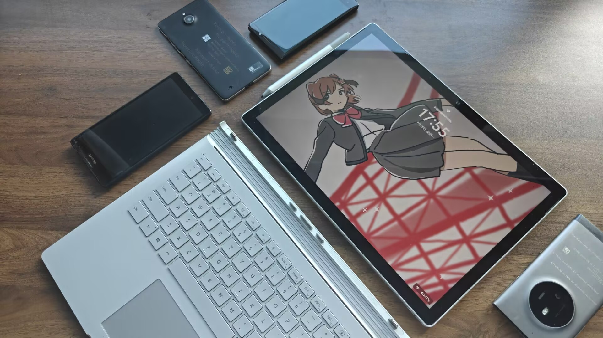

十年前的夏天，我在某个酒店前台看到了一台蓝色Surface Pro 4。他与当时一众傻大黑粗的Windows笔记本似乎完全不是同一个世界的。这也是我头一次知道，原来电脑还能触屏，甚至可以把键盘拆下来。轻便、优雅、与众不同——这是我对Surface系列的第一印象

从此我便对这个系列产生了浓厚的兴趣。后来我在网上看到了Surface Book初代的宣传片，屏幕从底座分离的那一刻给我的震撼，不亚于Dario首次体验Claude Mythos时被吓到眩晕瘫坐，仿佛看到了原子弹爆炸。带上底座是台带独显的高性能笔电，拆下是个可以书写的平板，当时还在小学的我坚信着这便是电脑的终极形态。然而，1w起步的价格实在是令人望而却步，我也只能看着网上的评测视频，幻想自己能拥有一台顶配Surface Book

——终于，这个梦想在十年后得到了实现

---

事情的起因是我的小米平板7 Pro被别人拿去用了，而我正缺一个能用来学习和看番的平板。我也寻思安卓平板已经玩腻了（生态和系统适配奇差，这个或许得另讲了），不如整个Surface玩玩！

起初打算弄个Surface Pro 8，一看价格i7 16+256裸机就要3k，带上笔和键盘更是要4k+。而Surface Book 3 3.5k可以买到32+1T的顶配，就直接拿下了这台13.5英寸的版本。最后又花了100买了只笔，共花费3.6k

具体配置如下：

| 处理器 | Core i7-1065G7             |
| ------ | -------------------------- |
| 显卡   | NVIDIA GeForce GTX 1650 4G |
| 内存   | 32G LPDDR4                 |
| 存储   | 1T SSD                     |
| 屏幕   | 3000*2000 267PPI           |

***

初看Surface Book，这似乎只是一台普通的笔记本电脑，屏幕巨大的黑边反倒显得它有些落后于时代。不过Surface系列一贯顶级的做工，以及别具一格的铰链设计还是能使它从一众笔记本中脱颖而出，质感完全不输MacBook

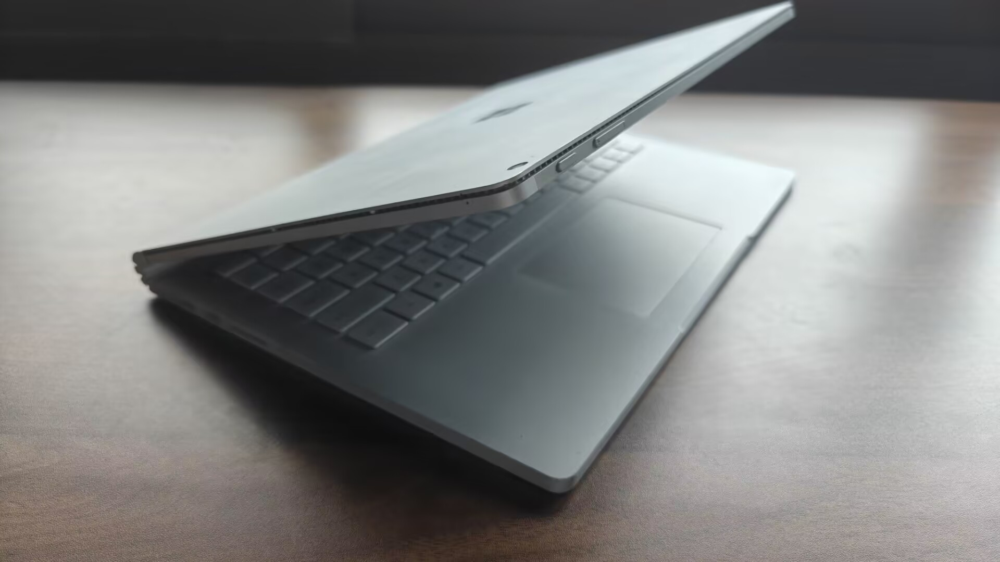

在使用的过程中，你很难找到Surface Book和一般Windows笔记本的区别：它运行着完整的x86 Windows系统，生产力远非安卓之流所可碰瓷。学校的实验报告、PPT等等都可以在Surface Book上轻松完成。开几个VS写点程序，只要不是特别大的项目，它均能胜任

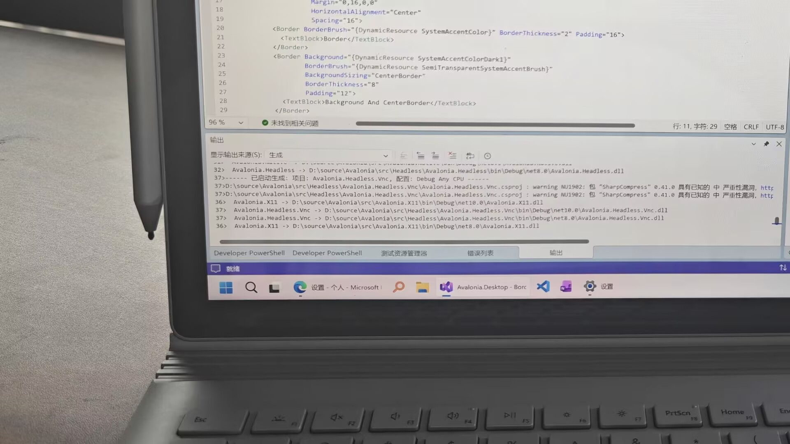

与Surface Pro相比，Surface Book键盘的键程更高，打字的体验完全不输一般笔记本，甚至可以说是我用过最舒服的笔记本键盘了。不过触控板依旧是传统跷跷板，只有下半部分能按下，勉强能用

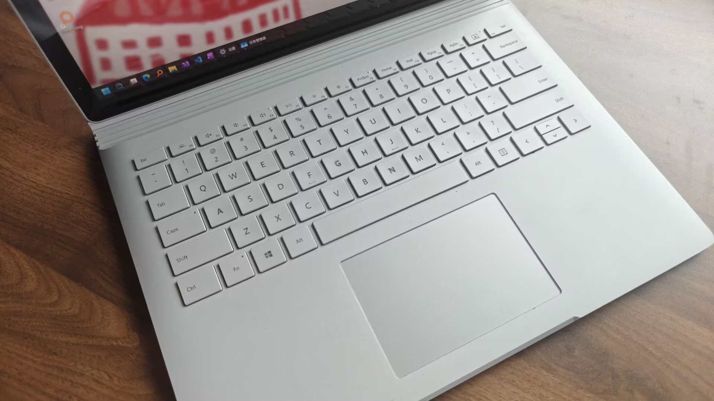

Surface Book的续航也强于一般Windows平板。在我电池健康度只有80%的情况下，单码点字6-7小时不在话下；而即使是写程序这种相对比较重的活，也能做到4-5小时，可以保证撑过学校半天的课还剩30%左右的电量——这比我Arrow Lake U9 285H的Magicbook 16 Pro 2025要好得多

游戏方面的表现比我想象中的要好。小游戏自然不在话下，地平线4这种优化好些的大型3A居然能跑到高画质1080p60帧，看来独显并不是摆设

不过代价还是有的——13.5英寸的版本没有风扇，导致屏幕部分发热严重，玩久了还是会降频

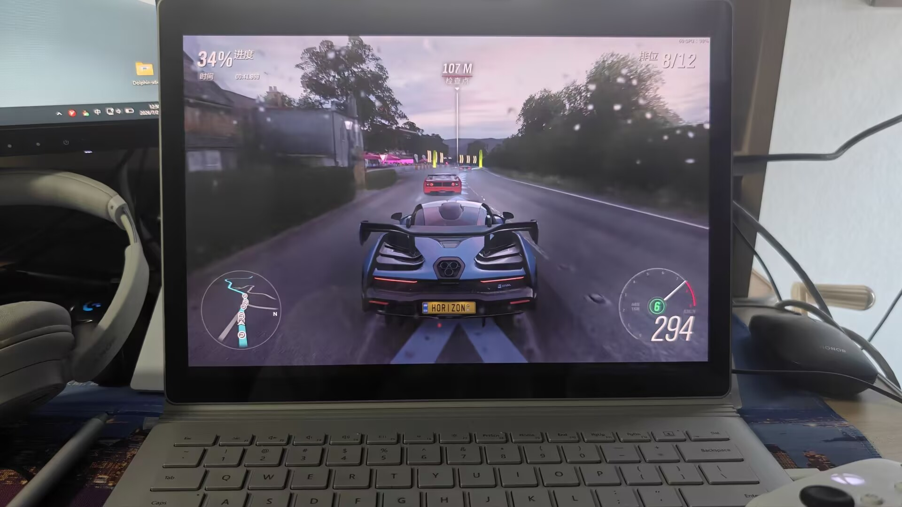

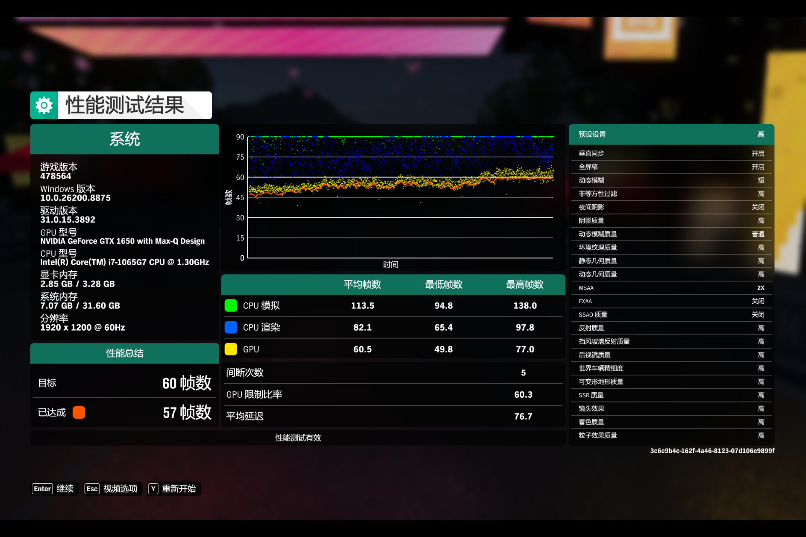

***

真正让Surface Book和一般笔记本区别开的，还是他的分离功能

按下键盘右上角的"分离"键或点击任务栏上的图标，伴随着清脆的声响，系统右下角会弹出拆卸通知，此时就能将整个屏幕从底座上拆下！

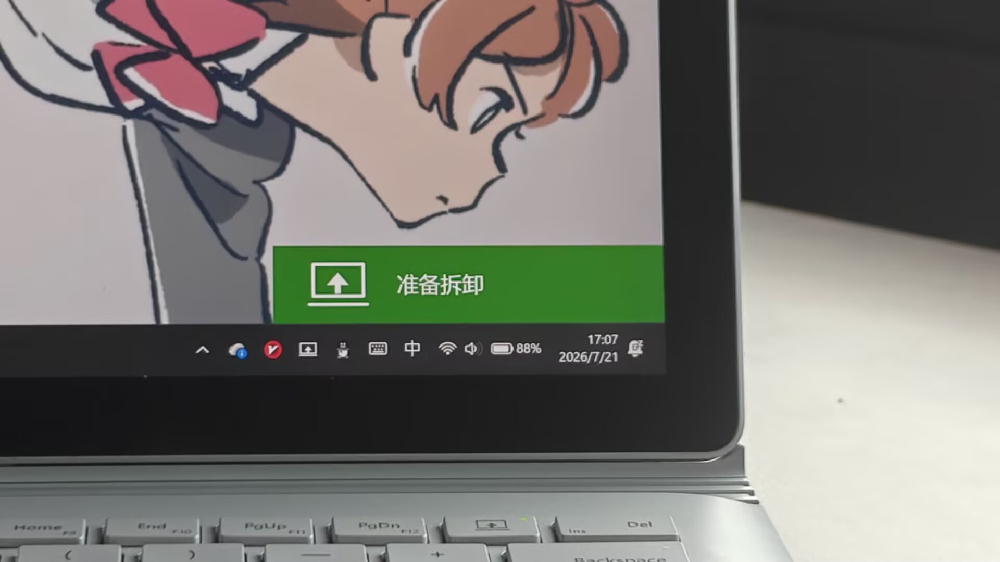

卸掉了底座后的Surface Book减轻了一半多的重量，变成了一个13.5英寸的Windows平板

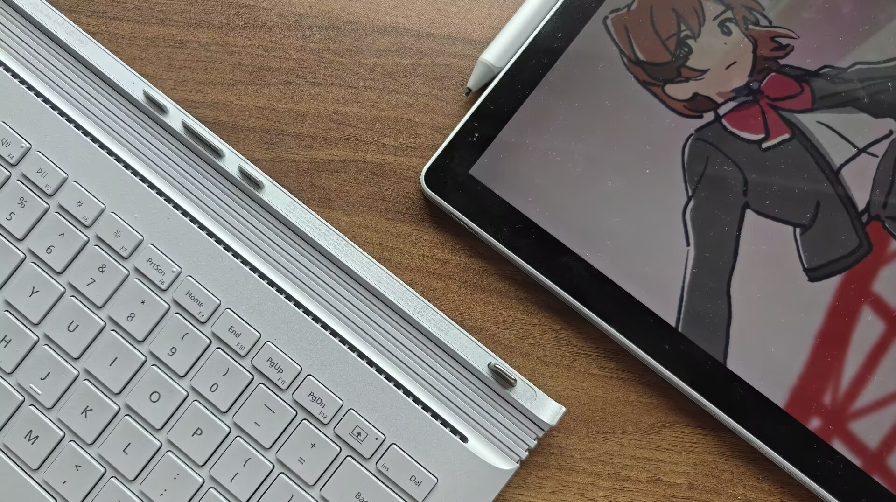

你可以用它来干一般平板能做到的任何事情——阅读，书写，画画……

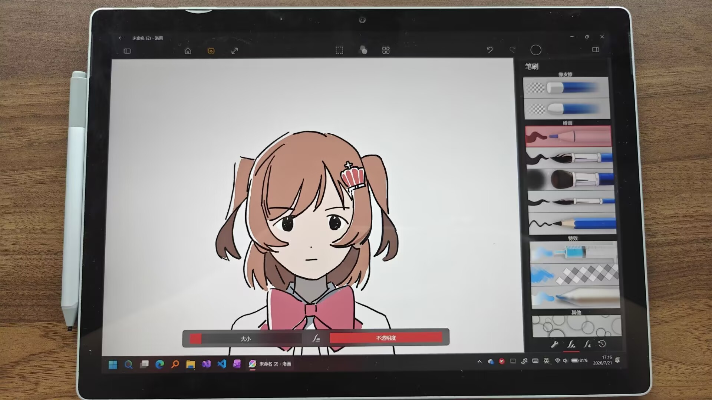

然而，我几乎从来不将底座和屏幕分离使用——屏幕部分的电池只有18wh，是底座电池的1/3不到

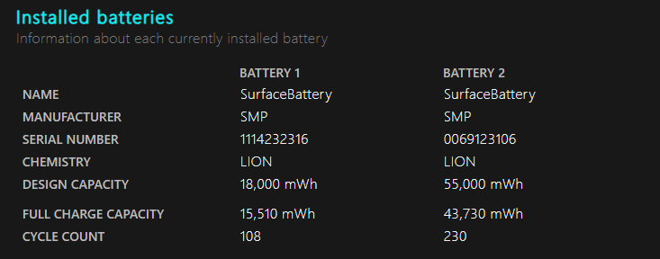

这导致底座分离后，即使什么都不做，都能看到电量以肉眼可见速度的下降。如果想干点事情，基本上不到一个小时电量就会耗尽

要想只带平板部分出门，必须带上足够大容量的充电宝，以及一根专用的Surface Connect充电线——屏幕部分没有单独的USB-C接口，只能借底座连接处充电。

完全没有一个平板该有的便携性啊喂！

***

好在微软还留了一手：拆卸后的平板还可以反着装回原来的底座，压到底后还是一台平板。

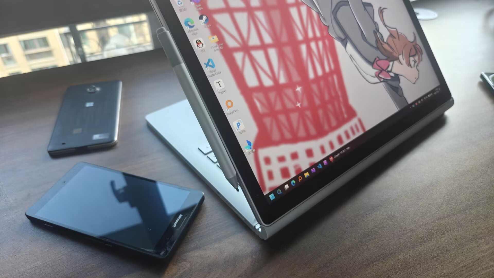

这可比单独的屏幕部分强太多了。独立显卡能够正常连接，而屏幕和底座的电池会交替使用，跟笔记本形态下的续航完全一致

底座还可以作为一个能任意调整角度的屏幕支架，能很好地立在平面上，非常适合看番之类的场景

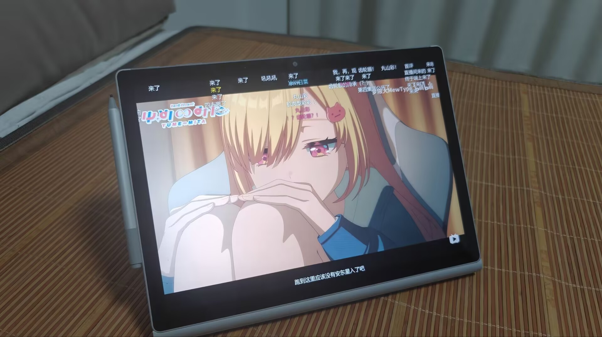

Surface Book 13.5''上这块3000*2000的PixelSense显示屏有着顶级的素质，观感非常舒适（唯一的缺点就是没有高刷）

假如游戏支持触控，用这个形态来玩也非常合适。比如在上课来几局小丑牌消磨时间，或是推几部gal（？

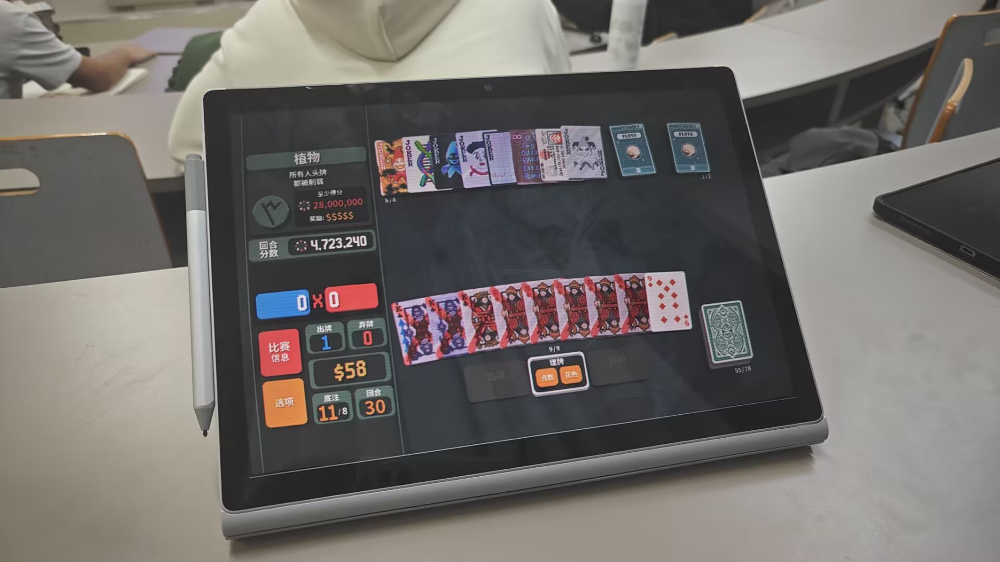

***

触控适配依旧是Windows平板最大的短板。这台Surface Book到手时还是Windows 10，重装一遍Windows 11后，系统本身的触控体验有了显著的改善

但第三方软件的适配就没那么乐观了。但在UWP已死、WinUI3无人在意的现状之下，很少再有人专门做桌面端的触控适配

除了自带的应用以及少数社区开发的UWP/WinUI3应用之外，很多时候对触控相对友好的应用，还是Electron做的。。。

***

在书写方面，Surface Pen的笔头自带一些阻力，完全没有一般触控笔那种戳玻璃的感觉，薄纱我之前用的小米焦点触控笔+类纸膜

Surface Pen再配上OneNote就是王炸组合，记笔记/写作业非常舒爽

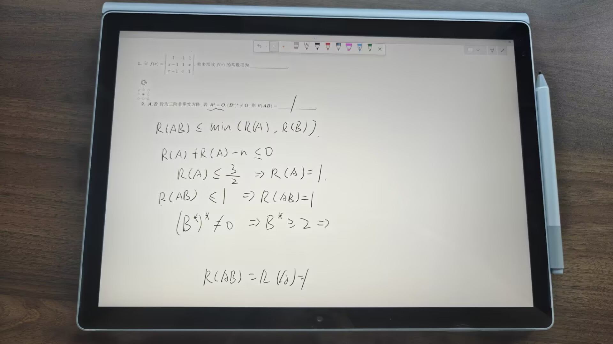

老款Surface Pen有书写抖动的通病，墨迹在末端容易出现明显抖动

这个问题在后来的Surface Slim Pen中才有所改善（Surface Book 3也支持，但没法磁吸而且需要单独充电盒，我还是将就着用老款了）

> Surface Pen还可以自定义后面的快捷按钮，把长按设置成屏幕截图，双击设置成Copilot键，再用PowerToys把Copilot键（实际上是个组合快捷键）映射到Ctrl+V，最终就可以长按截图+双击粘贴一气呵成
>
> ~~Copilot键最有用的一集~~

***

尽管我使用的过程中还是会是不是遇到一些小问题（有时无法拆卸，自动旋转失效等等），但毕竟Surface Book是唯一一个能够同时满足我编程、学习和娱乐需求的设备。因此这几个月，我基本上出门都是带着Surface Book

我还是很希望看到Surface Book能出下一代的，可惜他的继承者Surface Laptop Studio系列砍掉了可分离底座，改成了悬浮式设计

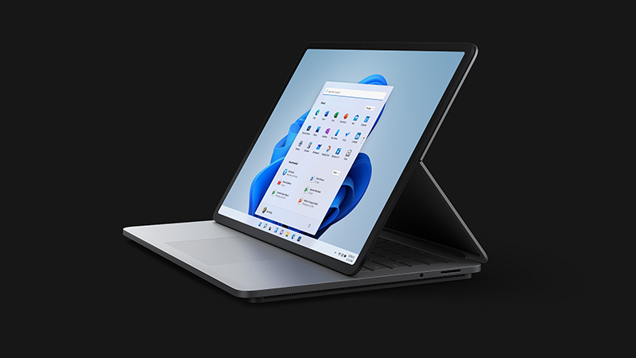

这样改其实不无道理。为了可拆卸的平板形态，Surface Book做了太多的妥协：将处理器等核心部分转移到屏幕，导致散热困难；塞入大量精密的机械结构，使其彻底丧失可维护性；铰链制造成本极高，价格始终下不来……而分离后烂透了的续航，又很难让人觉得这笔交易值得

再后来，Laptop Studio系列也被砍掉，Surface家族只剩下二合一平板和普通的笔记本。就连最新出的Surface Laptop Ultra，也是普通笔记本的设计。Surface Book算是彻底消失在了历史长河中

——假如在另一个不同的世界线，Surface Book撑到了Lunar Lake发布，在这个Windows笔记本也能实现真正的低能耗、长续航的时代，它的结局是否又会有所改变呢？
