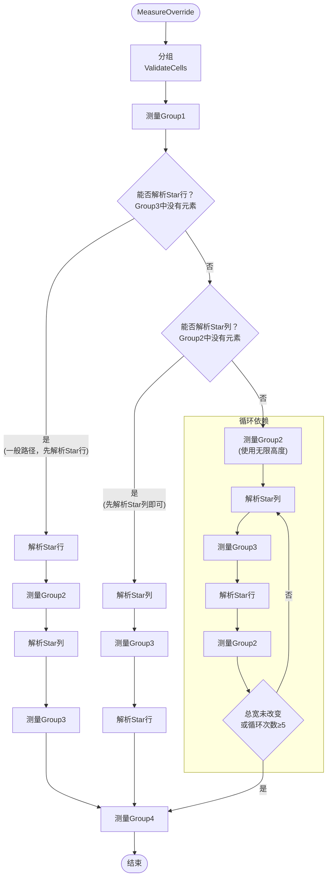

# Avalonia源码解读：Grid（网格控件）

# Measure阶段

> **快速路径**：当仅仅存在一个行/列(或未定义行列)时，将子元素中最大的宽和高设置为为Grid的大小即可。
>
> ```csharp
> gridDesiredSize = new Size(
>        Math.Max(gridDesiredSize.Width, child.DesiredSize.Width),
>        Math.Max(gridDesiredSize.Height, child.DesiredSize.Height));
> ```
>

在一般情况下，我们定义了两个及以上以上的行/列，就需要一套特定的算法进行计算

我们知道，Grid的行/列定义有`Auto`、`Star`、`Pixel`三类

简化后的定义如下：

```csharp
public class Definition
{
    public double MinSize { get; set; }// 对应MinHeight(MinWidth)，以Pixel为单位
    public double MaxSize { get; set; }// 对应MaxHeight(MaxWidth)，以Pixel为单位
    public GridLength Size { get; set; }// 对应Height(Width)，对应不同单位下的值
    double MeasureSize { get; set; }// 测量阶段的结果
    double FinalSize { get; set; }// 排列阶段的结果 
    double FinalOffset { get; set; }// 最终偏移量
} 
```

> 此处将Width/Height更改为Size，不再区分行列
>
> 源代码中为了性能，上面的一些属性（如`FinalSize`、`MaxSize`）使用的是同一个字段，为便于理解，这里将他们拆分开来单独列出。具体代码可以自行前往[Avalonia存储库](https://github.com/AvaloniaUI/Avalonia/blob/master/src/Avalonia.Controls/Grid.cs)查看

在测量 (Measure) 的过程中，Grid遵循**"可确定大小优先"**的原则。因此，他们将要渲染的元素分为四组来决定测量顺序。

|        | `Px` | `Auto` | `Star` |
| ------ | ---- | ------ | ------ |
| `Px`   | 1    | 1      | 3      |
| `Auto` | 1    | 1      | 3      |
| `Star` | 4    | 2      | 4      |

通常情况下，测量的顺序如下：


根据 `Group2`、`Group3` 元素的存在情况，测量组和解析 `Star` 项的顺序会有所不同，但 `Group1` 和 `Group4` 的测量顺序始终不变，具体流程将在后续介绍。

我们先依次介绍测量过程中使用的重要方法。

***

## `ValidateCells`：分组，预处理所有子元素

分组前，`Grid` 会先初始化行/列定义的结构：如果只有行定义，`Grid` 会自动添加一个  `Width = *`  的列定义；同理，如果只有列定义，会自动添加一个行定义

分组过程中，`Grid` 中的每个元素都将被视作一个`Cell`，他们根据所在行/列的类型被分配到不同组中，以便稍后进行进一步的计算

所有`Cell`以链表的形式被缓存，每个`CellGroup`存储的是当前组的头节点，在后续测量中使用`Cell.Next`进行遍历


## `MeasureCellsGroup`：测量组

### Group = 1：项的类型为 `Px/Auto`

测量每个元素的机制如下：

- `Px` 项：`def.Size` 作为元素 `Measure` 边界
- `Auto` 项：传入无限尺寸作为元素 `Measure` 边界

  同时，当某个元素测量完成时，还会**根据元素的高度更新元素所在项的最小大小**

  *项最小尺寸的**初始值**与最大尺寸由用户设定，如`RowDefinition.Min/MaxHeight`*

  ```
  def.MinSize = Math.Clamp(child.DesiredSize, def.MinSize, def.MaxSize)
  ```
  
  若元素的 `RowSpan > 1`（可能跨项），则**不更新项最小值**，并且在其他元素均测量完毕后，确保这些跨项元素尺寸在**其所在所有项尺寸**的最小值/最大值之间。

### Group ≠ 1：元素在某个 `Star `类型的项中

> 根据顺序，此时已完成目标组 `Star` 项的大小解析，因此 `definitions.MeasureSize` 是有值的

使用`GetMeasureSizeForRange`方法，遍历元素跨越的所有项，将这些项的最小值(`Auto`项)或测量值(`Star`项)相加，得到元素测量时的边界

```csharp
private static double GetMeasureSizeForRange(
    IReadOnlyList<DefinitionBase> definitions,
    int start/*起始项位置*/,
    int count/*跨越项数(RowSpan)*/,
    double spacing)
{
    double measureSize = -spacing;
    int i = start + count - 1;
    do
    {
        measureSize +=
            spacing + // 跨行元素可忽视所跨项之间的spacing
            (definitions[i].SizeType == LayoutTimeSizeType.Auto ?
            definitions[i].MinSize :
            definitions[i].MeasureSize);
    } while (--i >= start);

    return measureSize;
}
```

同理，每个元素测量完成时也会更新其所在行的最小值，也会在所有元素测量完成后确保跨行元素高度在正确范围内。


## `ResolveStar`：统一解析Star行/列，分配权重

`Group1` 测量完毕后，我们已经得到了所有固定元素的尺寸，现在以以下流程计算各 `Star` 项的尺寸：

1. ### 预处理权重

   遍历`definitions`，统计Star项的数量并得到最大权重`maxStar`，同时将所有Star项的`MeasureSize`设置为1.0，表示尚未在后续阶段解析。

   引入`scale`值用于后续缩放，防止浮点溢出：

   - 若存在Infinity权重，设置`scale = -1.0`
   - 若不存在Infinity权重但权重和可能溢出(`starCount * maxStar > Double.Max`)，将`scale`设置为2的负次幂

2. ### 计算可用空间，预处理约束

   再次遍历`definitions`，计算所有非Star项所占用的空间`takenSize`

   对于 `Star` 项，计算缩放后的权重值`starWeight = star * scale`，并累计到`totalStarWeight`

   - 若scale < 0（存在Infinity权重），将Infinity项映射为 1，其余映射为 0

   如果项存在最小约束(`MinSize > 0`，由用户设置)，将该项加入"最小约束列表"，并暂存比率`def.minRatio = starWeight / def.MinSize`

   同理，若存在最大约束(`MaxSize ≠ Infinity`)，将该项加入"最大约束列表"，暂存`def.maxRatio = starWeight / def.MaxSize;`

   > 为提升性能，实际实现中"最小约束列表"和"最大约束列表"存储在同一列表`definitionIndices`中，分别为前后两个部分

3. ### 迭代解析约束项

   来看一个例子：

   ```xaml
   <!--C1--><ColumnDefinition Width="*" MinWidth="120"/>
   <!--C2--><ColumnDefinition Width="2*"/>
   <!--C3--><ColumnDefinition Width="3*" MaxWidth="150"/>
   ```

   假设可用尺寸 `S=400`，这时候我们可以发现：如果要满足定义中的 `Min/MaxWidth` 约束，是无法实现 1 : 2 : 3 的比例的。因此，我们需要将与**比例差距最大**的项"锁定"为 `Min/MaxWidth` 

   但我们又希望锁定后的比例尽可能接近定义的比例，因此 `Grid` 使用了以下算法：

   ```mermaid
   flowchart TD
       A["阶段3：处理约束项"]
       B["按照 最小比率、最大比率 排序约束列表"]
       C{"有剩余空间且存在未处理的约束项？"}
       D["计算当前比例"]
       E{"是否违反某个约束？"}
       F["选择偏差最大的约束"]
       G["将该项尺寸锁定为此约束值"]
       H["更新剩余权重与剩余空间"]
       I["结束"]
   
       A --> B --> C
       C -- "是" --> D
       D --> E
       C -- "否" --> I
       E -- "是" --> F
       F --> G --> H
       E -- "否" --> I
       H --> C
   ```
   
   先对最小约束列表按照比率**降序**，最大约束列表按照比率**升序**排序

   初始 `remainingAvailableSize=S=400`，`remainingStarWeight=W=6`

   下面按照每次锁定"差异最大"的一个`definition`来迭代解析约束项：

   ##### 第一次迭代：

   - 从最小/最大约束列表中分别选出 `C1.minRatio` == 1/120 == 0.008333 ，`C3.maxRatio` == 3/150 == 0.02

   - 计算比例`proportion = remainingStarWeight / remainingAvailableSize` = 6/400 = 0.015 

   - 判定是否违反比例：

     - min 违反条件：`minRatio < proportion` => 0.008333 < 0.015（成立）
     - max 违反条件：`maxRatio > proportion` => 0.02 > 0.015（成立）
   
     > 如果认为"比例"不好理解，可以从反面考虑：
     >
     > 假设步骤2中 `def.MinSize / starWeight` 代表**每颗星的最小大小**`minStarSize`，`def.MaxSize / starWeight`代表**每颗星允许的最大大小**`maxStarSize`
     >
     > 那么 `remainingAvailableSize / remainingStarWeight` 代表**当前每颗星的大小**`currentStarSize`
     >
     > 必须满足`minStarSize ≤ currentStarSize ≤ maxStarSize`，否则就需要选择偏离最大的项进行锁定
     
   - 二者都需要锁定，选择**偏离更大**的一项：
   
     - 对最小约束的偏离：`proportion / minRatio` = 0.015 / 0.008333 ≈ 1.8

     - 对最大约束的偏离：`maxRatio / proportion` = 0.02 / 0.015 ≈ 1.333

     - 1.8 > 1.333 => 优先锁定 `C1` 尺寸为 `R1.MinSize`
   
   - 执行锁定：
       - 设置 `R1` 尺寸为约束最小值：`resolvedSize = C1.MinSize  = 120`
       
       - 更新可用空间和剩余权重：
       
         `remainingAvailableSize = 400 - resolvedSize  = 400-120 = 280`
       
         `remainingStarWeight = 6 - R3.starWeight = 6 - 1 = 5`
       

   ##### 第二次迭代：

   - `maxRatio` = 0.02（仍为 `C3` ）
   - `proportion` = 5/280 ≈ 0.017857
   - 仅违反最大约束：0.02 > 0.017857 => `R3` 尺寸锁定为 `C3.MaxSize`
   - 执行锁定：
   
     - 设置 `C3` 尺寸为约束最大值：`resolvedSize = C3.MaxSize` = 150
     - `remainingAvailableSize` = 280 -150 = 130；`remainingStarWeight` = 5 - 3 = 2
   
   
   最小/最大约束列表均为空 => 退出。

4. ### 检测异常场景并重复执行2、3

   完成步骤3后，可能会有以下异常场景：

   - `remainingAvailableSize > 0` 且 `Star` 项全部处理完毕：所有 `Star` 项都被其最大约束锁定，但所有最大约束之和仍小于边界

     遍历所有项，解锁**存在最小约束**的项，重新执行步骤2、3为其分配空间

   - `remainingAvailableSize < 0`：某些项被最小约束锁定，但所有最小约束之和超过了边界

     同理，解锁**存在最大约束**的项，重新执行2、3


5. ### 前缀和算法分配剩余空间

   相比`权重/权重总和*剩余空间`，此算法**可以避免浮点数计算带来的精度丢失**

   可以用一个例子说明此算法：

   假设权重分别为`[1, 2, 3]`，剩余空间为6

   计算权重前缀和`[1, 3, 6]`

   现在以权重从大到小的顺序开始分配

   - 分配 `6*(3/6) = 3`，剩余空间 6-3=3
   - 分配 `3*(2/3) = 2`，剩余空间 3-2=1
   - 分配 `1*(1/1) = 1`，剩余空间 1-1=0，完成

   简化后的算法如下（此处默认所有项的类型为 `Star` ）：

   ```csharp
   Array.Sort(definitions);
   
   // 计算前缀和
   totalStarWeight = 0.0;
   for (int i = 0; i < definitions.Length; ++i)
   {
       DefinitionBase def = definitions[i];
       totalStarWeight += def.MeasureSize;// MeasureSize在此处代表Star数量
       def.SizeCache = totalStarWeight;// SizeCache用于缓存前缀和结果
   }
   
   // 从后向前遍历
   for (int i = definitions.Length - 1; i >= 0; --i)
   {
       DefinitionBase def = definitions[i];
       double resolvedSize = (availableSize - takenSize) * (def.MeasureSize / def.SizeCache);
       def.MeasureSize = resolvedSize;
       takenSize += resolvedSize;
   }
   ```

***

现在，你应该对测量中使用的一些算法有了大概了解。但测量顺序具体是怎么样的呢？以及，为什么要遵守这样的测量顺序？

## 处理循环依赖

来看下面的情况：

|                   | column width="Auto" | column width="*" |
| ----------------- | :------------------ | ---------------- |
| row height="Auto" |                     | cell 1 2         |
| row height="*"    | cell 2 1            |                  |

由于 `cell 2 1` 的宽度决定了 `Auto` 列的宽度，进而间接决定 `cell 1 2`所在列的宽度，需要先计算 `cell 2 1`。然而，由于 `cell 1 2` 的高度决定了 `Auto` 行的高度，同理， `cell 2 1` 也理应先被计算——`Auto` 与 `Star` 的行列相互影响，这就造成了 `Grid` 行列的**循环依赖**问题。

因此，在检测到循环依赖后，处理的顺序会有所不同：

> `Group1`测量完毕后，如果`Group3(Auto行，Star列)`中有元素，说明**此`Auto`行的大小依赖于`Group3`中元素的大小**，我们暂时**无法解析`Star`行**
>
> 若不能解析`Star`行但能解析`Star`列，我们只需将解析行列的顺序调换一遍即可，在此处不再赘述
>
> 同理，如果无法解析`Star`行且`Group2(Star行，Auto列)`中有元素，说明**`Auto`列的大小依赖于`Group2`中元素的大小**，**无法解析`Star`列**
>
> **行、列均无法解析**时，进入**循环依赖分支**



在此分支中，我们先在测量`Group2`时使用无限高度以先**得到其宽度**，再解析`Star`列。

Star列被解析完毕后，就可以测量`Group3`中的元素了

此时再解析Star行即可重新以正确的行高测量`Group2`。

> 但是，还有一种更为极端的情况：`Group2`中的元素再使用**不同高度测量时得到的宽度**不同（例如，纵向排列的 `WrapPanel` ）
>
> 这代表第一次使用无限高度测量`Group2`后解析得到**`Star`列的宽度是错误的**！这时候我们需要返回并重新对`Group3`进行测量...
>
> 在重新测量的过程中，我们还要将Auto项的尺寸恢复到测量`Group1`后的状态，**来尽可能保证测量`Group2`时的参数相等**
>
> 还是看下面的动画吧..
>
> 此流程会一直循环，直到**两次`Group2`宽度的测量结果相同**或循环次数≥5


# Arrange阶段

相比之下，Arrange阶段需要做的事情就少很多了。

## Spacing处理

在`Measure`阶段前，我们在原边界大小的基础上减去所有间距之和后再进行测量，对spacing的单独处理仅限于跨行元素（见`GetMeasureSizeForRange`）。

因此，在处理元素最终的偏移量`FinalOffset`时，我们需要在每次迭代都加上对应的`spacing`

```csharp
for (int i = 0; i < definitions.Count; ++i)
{
    definitions[(i + 1) % definitions.Count].FinalOffset = definitions[i].FinalOffset + definitions[i].FinalSize + spacing;
}
```

