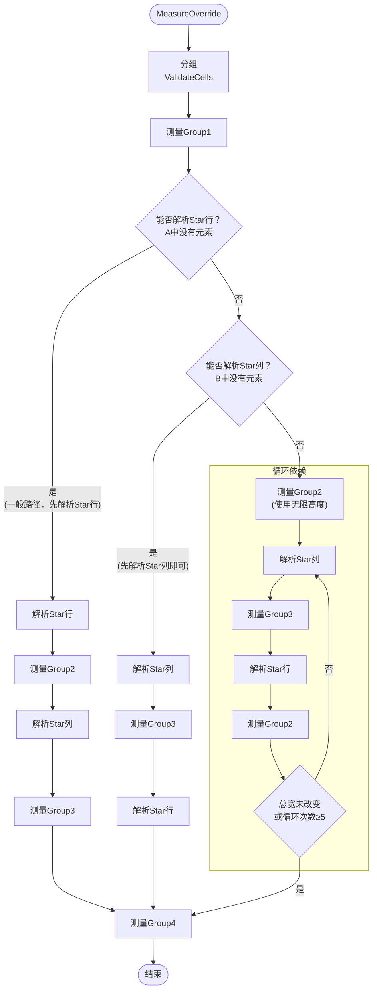

# Avalonia源码解读：Grid（网格控件）

在各类XAML UI框架中，`Grid` 是一种非常灵活且常用的布局控件，它可以创建复杂的用户界面布局。`Grid` 允许开发者通过定义行和列来组织界面元素，每个元素可以精确地放置在网格的特定区域内

本文以 Avalonia 框架为例，讲解 `Grid` 控件的工作原理

> 事实上，UWP、WinUI 3 和 Avalonia 等XAML框架中 `Grid` 控件的源码全都源自于 WPF 中的实现，以至于绝大部分代码乃至注释都是相同的
>
> 因此，本文中你能了解到的机制也可应用于其他 XAML UI 框架

***

# Measure 阶段

> **快速路径**：当仅仅存在一个行/列(或未定义行列)时，将子元素中最大的宽和高设置为为 `Grid` 的大小即可。
>
> ```csharp
> gridDesiredSize = new Size(
>     Math.Max(gridDesiredSize.Width, child.DesiredSize.Width),
>     Math.Max(gridDesiredSize.Height, child.DesiredSize.Height));
> ```

在一般情况下，我们定义了两个及以上以上的行/列，就需要一套特定的算法进行计算

我们知道，Grid的行/列定义有`Auto`、`Star`、`Pixel`三类

简化后的定义如下：

```csharp
public class Definition
{
    public double MinSize { get; set; }// 对应MinHeight(MinWidth)，以Pixel为单位
    public double MaxSize { get; set; }// 对应MaxHeight(MaxWidth)，以Pixel为单位
    public GridLength Size { get; set; }// 对应Height(Width)，对应不同单位下的值
    double MeasureSize { get; set; }// 测量阶段的结果
    double FinalSize { get; set; }// 排列阶段的结果 
    double FinalOffset { get; set; }// 最终偏移量
} 
```

> 此处将 `Width/Height` 更改为 `Size`，不再区分行列
>
> 源代码中为了性能，上面的一些属性（如`FinalSize`、`MaxSize`）使用的是同一个字段，为便于理解，这里将他们拆分开来单独列出。具体代码可以自行前往[Avalonia存储库](https://github.com/AvaloniaUI/Avalonia/blob/master/src/Avalonia.Controls/Grid.cs)查看

在测量 (`Measure`) 的过程中，`Grid` 遵循"**可确定大小优先**"的原则。因此，他们将要渲染的元素分为四组来决定测量顺序

|        | `Px` | `Auto` | `Star` |
| ------ | ---- | ------ | ------ |
| `Px`   | 1    | 1      | 3      |
| `Auto` | 1    | 1      | 3      |
| `Star` | 4    | 2      | 4      |

通常情况下，测量的顺序如下：


> 根据 `Group2`、`Group3` 元素的存在情况，测量组和解析 `Star` 项的顺序会有所不同，但 `Group1` 和 `Group4` 的测量顺序始终不变
>
> 具体流程将在后面介绍

我们先依次介绍 `Measure` 过程中使用的主要算法

***

## `ValidateDefinitionsStructure、ValidateDefinitionsLayout`：初始化行/列定义

分组前，`Grid` 会先初始化行/列定义的结构：如果只有行定义，`Grid` 会自动添加一个  `Width = *`  的列定义；同理，如果只有列定义，会自动添加一个行定义

同时，如果传入了无限的长或宽，其对应的所有 `Star` 定义都会被视作 `Auto` 项

## `ValidateCells`：分组，预处理所有子元素

分组过程中，`Grid` 中的每个元素都将被视作一个 `Cell`，他们根据所在行/列的类型被分配到不同组中，以便稍后进行进一步的计算

所有 `Cell` 以链表的形式被缓存，每个 `CellGroup` 存储的是当前组的头节点，在后续测量中使用 `Cell.Next` 进行遍历


## `MeasureCellsGroup`：测量组

### Group = 1：项的类型为 `Px/Auto`

测量每个元素的机制如下：

- `Px` 项：`def.Size` 作为元素 `Measure` 边界

- `Auto` 项：传入无限尺寸作为元素 `Measure` 边界

  同时，当某个元素测量完成时，还会**根据元素的高度更新元素所在项的最小大小**

  *项最小尺寸的**初始值**与最大尺寸由用户设定，如`RowDefinition.Min/MaxHeight`*

  ```
  def.MinSize = Math.Clamp(child.DesiredSize, def.MinSize, def.MaxSize)
  ```

  若元素的 `RowSpan > 1`（可能跨项），则**不更新项最小值**，并且在其他元素均测量完毕后，确保这些跨项元素尺寸在**其所在所有项尺寸**的最小值/最大值之间

### Group ≠ 1：元素在某个  `Star` 类型的项中

> 根据顺序，此时已完成目标组 `Star` 项的大小解析，因此 `definitions.MeasureSize` 是有值的

使用 `GetMeasureSizeForRange` 方法，遍历元素跨越的所有项，将这些项的最小值(`Auto` 项)或测量值(`Star` 项)相加，得到元素测量时的边界

```csharp
private static double GetMeasureSizeForRange(
    IReadOnlyList<DefinitionBase> definitions,
    int start/*起始项位置*/,
    int count/*跨越项数(RowSpan)*/,
    double spacing)
{
    double measureSize = -spacing;
    int i = start + count - 1;
    do
    {
        measureSize +=
            spacing + // 跨行元素可忽视所跨项之间的spacing
            (definitions[i].SizeType == LayoutTimeSizeType.Auto ?
            definitions[i].MinSize :
            definitions[i].MeasureSize);
    } while (--i >= start);

    return measureSize;
}
```

同理，**每个元素测量完成时也会更新其所在项的最小值**，也会在所有元素测量完成后确保跨项元素尺寸在正确范围内


## `ResolveStar`：统一解析Star项，分配权重

`Group1` 测量完毕后，我们已经得到了所有固定元素的尺寸，现在以以下流程计算各 `Star` 项的尺寸：

1. ### 预处理权重

   遍历 `definitions`，统计Star项的数量并得到最大权重 `maxStar`，同时将所有Star项的 `MeasureSize` 设置为 1.0，表示尚未在后续阶段解析。

   引入 `scale` 值用于后续缩放，防止浮点溢出：

   - 若存在 Infinity 权重，设置 `scale = -1.0`
   - 若不存在 Infinity 权重但权重和可能溢出(`starCount * maxStar > Double.Max`)，将 `scale` 设置为 2 的负次幂

2. ### 计算可用空间，预处理约束

   再次遍历 `definitions` ，计算所有非Star项所占用的空间 `takenSize`

   对于 `Star` 项，计算缩放后的权重值 `starWeight = star * scale`，并累计到 `totalStarWeight`

   - 若 scale < 0（存在Infinity权重），将 Infinity 项映射为 1，其余映射为 0

   如果项存在最小约束(`MinSize > 0`，由用户设置)，将该项加入"最小约束列表"，并暂存比率 `def.minRatio = starWeight / def.MinSize`

   同理，若存在最大约束(`MaxSize ≠ Infinity`)，将该项加入"最大约束列表"，暂存 `def.maxRatio = starWeight / def.MaxSize`

   > 为提升性能，实际实现中"最小约束列表"和"最大约束列表"存储在同一列表 `definitionIndices` 中，分别为前后两个部分

3. ### 迭代解析约束项

   来看一个例子：

   ```xaml
   <!--C1--><ColumnDefinition Width="*" MinWidth="120"/>
   <!--C2--><ColumnDefinition Width="2*"/>
   <!--C3--><ColumnDefinition Width="3*" MaxWidth="150"/>
   ```

   假设可用尺寸 `S=400`，这时候我们可以发现：如果要满足定义中的 `Min/MaxWidth` 约束，是无法实现 1 : 2 : 3 的比例的。因此，我们需要将与**比例差距最大**的项"锁定"为 `Min/MaxWidth` 

   但我们又希望锁定后的比例尽可能接近定义的比例，因此 `Grid` 使用了以下算法：

   ```mermaid
   flowchart TD
       A["阶段3：处理约束项"]
       B["按照 最小比率、最大比率 排序约束列表"]
       C{"有剩余空间且存在未处理的约束项？"}
       D["计算当前比例"]
       E{"是否违反某个约束？"}
       F["选择偏差最大的约束"]
       G["将该项尺寸锁定为此约束值"]
       H["更新剩余权重与剩余空间"]
       I["结束"]
   
       A --> B --> C
       C -- "是" --> D
       D --> E
       C -- "否" --> I
       E -- "是" --> F
       F --> G --> H
       E -- "否" --> I
       H --> C
   ```

   先对最小约束列表按照比率**降序**，最大约束列表按照比率**升序**排序

   初始 `remainingAvailableSize=S=400`，`remainingStarWeight=W=6`

   下面按照每次锁定"差异最大"的一个 `definition` 来迭代解析约束项：

   ##### 第一次迭代：

   - 从最小/最大约束列表中分别选出 `C1.minRatio` == 1/120 == 0.008333 ，`C3.maxRatio` == 3/150 == 0.02

   - 计算比例 `proportion = remainingStarWeight / remainingAvailableSize` = 6/400 = 0.015 

   - 判定是否违反比例：

     - 违反最小约束：`minRatio < proportion` => 0.008333 < 0.015（成立）
     - 违反最大约束：`maxRatio > proportion` => 0.02 > 0.015（成立）

     > 如果认为"比例"不好理解，可以从反面考虑：
     >
     > 假设步骤 2 中 `def.MinSize / starWeight` 代表**每颗星的最小大小** `minStarSize`，`def.MaxSize / starWeight` 代表**每颗星允许的最大大小**`maxStarSize`
     >
     > 那么 `remainingAvailableSize / remainingStarWeight` 代表**当前每颗星的大小**`currentStarSize`
     >
     > 必须满足 `minStarSize ≤ currentStarSize ≤ maxStarSize`，否则就需要选择偏离最大的项进行锁定

   - 二者都需要锁定，选择**偏离更大**的一项：

     - 对最小约束的偏离：`proportion / minRatio` = 0.015 / 0.008333 ≈ 1.8

     - 对最大约束的偏离：`maxRatio / proportion` = 0.02 / 0.015 ≈ 1.333

     - 1.8 > 1.333 => 优先锁定 `C1` 尺寸为 `C1.MinSize`

   - 执行锁定：

     - 设置 `C1` 尺寸为约束最小值：`resolvedSize = C1.MinSize  = 120`

     - 更新可用空间和剩余权重：

       `remainingAvailableSize = 400 - resolvedSize  = 400-120 = 280`

       `remainingStarWeight = 6 - C3.starWeight = 6 - 1 = 5`

   ##### 第二次迭代：

   - `maxRatio` = 0.02（仍为 `C3` ）
   - `proportion` = 5/280 ≈ 0.017857
   - 仅违反最大约束：0.02 > 0.017857 => `C3` 尺寸锁定为 `C3.MaxSize`
   - 执行锁定：

     - 设置 `C3` 尺寸为约束最大值：`resolvedSize = C3.MaxSize` = 150
     - `remainingAvailableSize` = 280 -150 = 130；`remainingStarWeight` = 5 - 3 = 2


   最小/最大约束列表均为空 => 退出。

4. ### 检测异常场景并重复执行 2、3

   完成步骤 3 后，可能会有以下异常场景：

   - `remainingAvailableSize > 0` 且 `Star` 项全部处理完毕：所有 `Star` 项都被其最大约束锁定，但所有最大约束之和仍小于边界

     遍历所有项，解锁**存在最小约束**的项，重新执行步骤 2、3 为其分配空间

   - `remainingAvailableSize < 0`：某些项被最小约束锁定，但所有最小约束之和超过了边界

     同理，解锁**存在最大约束**的项，重新执行 2、3


5. ### 前缀和算法分配剩余空间

   相比`权重/权重总和*剩余空间`，此算法**可以避免浮点数计算带来的精度丢失**

   可以用一个例子说明此算法：

   假设权重分别为 `[1, 2, 3]`，剩余空间为 6

   计算权重前缀和 `[1, 3, 6]`

   现在以权重从大到小的顺序开始分配

   - 分配 `6*(3/6) = 3`，剩余空间 6-3=3
   - 分配 `3*(2/3) = 2`，剩余空间 3-2=1
   - 分配 `1*(1/1) = 1`，剩余空间 1-1=0，完成

   简化后的算法如下（此处默认所有项的类型为 `Star` ）：

   ```csharp
   Array.Sort(definitions);
   
   // 计算前缀和
   totalStarWeight = 0.0;
   for (int i = 0; i < definitions.Length; ++i)
   {
       DefinitionBase def = definitions[i];
       totalStarWeight += def.MeasureSize;// MeasureSize在此处代表Star数量
       def.SizeCache = totalStarWeight;// SizeCache用于缓存前缀和结果
   }
   
   // 从后向前遍历
   for (int i = definitions.Length - 1; i >= 0; --i)
   {
       DefinitionBase def = definitions[i];
       double resolvedSize = (availableSize - takenSize) * (def.MeasureSize / def.SizeCache);
       def.MeasureSize = resolvedSize;
       takenSize += resolvedSize;
   }
   ```

***

现在，你应该对测量中使用的算法有了大概了解。但测量顺序具体是怎么样的呢？以及，为什么要遵守这样的测量顺序？

我们再看一下之前的分组表：

|        | `Px` | `Auto`      | `Star`      |
| ------ | ---- | ----------- | ----------- |
| `Px`   | 1    | 1           | 3           |
| `Auto` | 1    | 1           | **3** *[A]* |
| `Star` | 4    | **2** *[B]* | 4           |

重点看加粗的部分：以 **A部分** (在 `Group3` 中)为例，在测量这部分的元素前，必须得到 `Auto` 列的大小。因此，测量 `Group3` 前必须完成对 `Group1` 和 `Group2`的测量

同样，B 部分在测量之前也必须得到 `Auto` 行的大小，在测量 `Group2` 前必须完成对 `Group1` 和 `Group3` 的测量

AB 部分的共同特性就是**同时存在于 `Auto` 和 `Star` 项**中，我们可以得出以下结论：

- A 部分中存在元素：测量 `Group1`、`Group2` 后才能测量 `Group3`
- B 部分中存在元素：测量 `Group1`、`Group3` 后才能测量 `Group2`

如果 A、B 部分都存在元素呢？比如下面的情况：

|                   | column width="Auto" | column width="*" |
| ----------------- | :------------------ | ---------------- |
| row height="Auto" |                     | cell 1 2 *[A]*   |
| row height="*"    | cell 2 1 *[B]*      |                  |

由于 `cell 2 1` 的宽度决定了 `Auto` 列的宽度，进而间接决定 `cell 1 2` 所在列的宽度，需要先计算 `cell 2 1`。然而，由于 `cell 1 2` 的高度决定了 `Auto` 行的高度，同理， `cell 2 1` 也理应先被计算—— `Auto` 与 `Star` 的行列相互影响，这就是 `Grid` 行列解析中的**循环依赖**问题。

综上所述，`Grid` 共有三种不同的测量顺序，流程图如下：



## 循环依赖的处理

对于产生了循环依赖的布局，我们无法直接测量 AB 组的大小。因此，我们需要先在测量 `Group2`（也就是 B 组） 时使用无限高度以先**得到其宽度**，再解析 `Star` 列

Star列被解析完毕后，就可以测量 `Group3` 中的元素了，此时再解析Star行即可重新以正确的行高测量 `Group2`

<video style="position: absolute; top: 0; left: 0; width: 100%; height: 100%;" id="video" controls="" width=400>
      <source id="mp4" src="@source/posts/assets/Avalonia等UI框架中Grid控件的工作原理/Grid_1.mp4" type="video/mp4">
</video>


### 更为极端的情况

如果 `Group2` 中的元素再使用**不同高度测量时得到的宽度**不同（例如，纵向排列的 `WrapPanel` ），这代表第一次使用无限高度测量 `Group2` 后解析得到**`Star`列的宽度是错误的**！这时候我们需要返回并重新对 `Group3` 进行测量...

在重新测量的过程中，我们还要将 `Auto` 项的尺寸恢复到测量 `Group1` 后的状态，**来尽可能保证测量 `Group2` 时的参数相等**

此流程会一直循环，直到**两次`Group2`宽度的测量结果相同**或循环次数 ≥5

<video style="position: absolute; top: 0; left: 0; width: 100%; height: 100%;" id="video" controls="" width=400>
      <source id="mp4" src="@source/posts/assets/Avalonia等UI框架中Grid控件的工作原理/Grid_2.mp4" type="video/mp4">
</video>


# Arrange 阶段

由于行列大小计算已经在 `Measure` 阶段完成，`Arrange` 阶段只需要计算每个行列的最终位置并处理一些特殊设置即可。


## 重新解析 `Star` 项

由于 `Measure` 阶段提供的约束可能与 `Arrange` 阶段提供的空间不一致，我们需要使用与 `ResolveStar` 相同的方式再次解析一遍 `Star` 项

至于为何两个阶段提供的空间可能不一致，就涉及到 `Measure/Arrange` 机制了，具体可参阅 [布局 - WPF | Microsoft Learn](https://learn.microsoft.com/zh-cn/dotnet/desktop/wpf/advanced/layout?view=netframeworkdesktop-4.8#LayoutSystem_Measure_Arrange)


## `Spacing` 处理

在 `Measure` 阶段前，我们在原边界大小的基础上减去所有间距之和后再进行测量，对 `spacing` 的单独处理仅限于跨行元素（见`GetMeasureSizeForRange`）。

因此，在处理元素最终的偏移量 `FinalOffset` 时，我们需要在每次迭代都加上对应的 `spacing`

```csharp
for (int i = 0; i < definitions.Count; ++i)
{
    definitions[(i + 1) % definitions.Count].FinalOffset = definitions[i].FinalOffset + definitions[i].FinalSize + spacing;
}
```


## 布局舍入 (`LayoutRounding`)

为了避免影响前面的测量进程，布局舍入在 `Arrange` 的最后阶段执行

- 遍历所有项，将其尺寸根据当前 DPI 四舍五入，并把**舍入后大小 - 原始大小**写入 `RoundingErrors`
- 计算舍入后大小 `roundedTakenSize` 与舍入前大小 `finalSize` 的差值。若不相等，就需要进一步调节各项以分配余额或去除溢出
- 将所有项根据 `RoundingErrors` 排序，在**差值最大的项**上增加或减少像素（以 `dpiIncrement = 1 / dpi` 为单位）进行调节，同时确保不低于 `MinSize`

> 顺带一提，代码中用了一段很长的注释来说明当前的布局舍入算法是存在问题且无法解决的：
>
> ```
> （由 Gemini 3 Pro 翻译）
> // 理论和历史说明。当前的问题——即在带有星号权重（*-weights）、
> // 最小和最大约束以及布局舍入的情况下向列（或行）分配空间——由来已久。
> // 特别是那个著名的特例：50列，最小值为1，可用空间为435——
> // 这正是根据人口比例向50个州分配美国众议院席位的问题。
> // 关于这一问题的算法和论文无数，最早可追溯到1700年代，包括这本书：
> // Balinski, M. 和 H. Young 所著的《Fair Representation》（公平代表），耶鲁大学出版社，纽黑文，1982年。
> //
> // 所有这些研究得出的一个惊人结果是：*任何*算法都难免会遭受一个或多个
> // 不良特性的困扰，例如“人口悖论”或“阿拉巴马悖论”。
> // 在这种情况下（套用我们的术语来说），增加一个像素的可用空间实际上
> // 可能会减少分配给特定列的空间，或者增加某列的权重反而可能会减少其分配量。
> // 这一点值得了解，以防有人抱怨这种行为；这与其说是一个 Bug，
> // 不如说是问题本身固有的特性。引用上面提到的书或数百篇参考文献之一，
> // 然后将其标记为“不予修复”（WontFix）。
> //
> // 幸运的是，我们的场景通常只有少量的列（约10列或更少），
> // 每列分配大量的像素（约50个或更多），人们甚至注意不到
> // 理论上不可避免的那种1像素的偏差，或者即使注意到了也不在乎。
> // 至少他们不应该在乎——没人应该使用 WPF 网格布局的结果来做
> // 定量决策；它的工作是产生合理的显示效果，而不是分配国会席位。
> //
> // 我们的算法比当前用于国会席位分配的算法（“亨廷顿-希尔”算法）
> // 更容易出现悖论，但它的运行速度更快：
> // 复杂度为 O(N log N) vs. O(S * N)，其中 N=定义的数量，S=可用像素的数量。
> // 并且如上所述，它在实践中产生了足够好的结果。
> //
> // 重申一点：所有这些仅在启用布局舍入时适用。
> // 当允许小数尺寸时，该算法在受限于最小/最大约束和
> // 浮点计算精度的情况下表现尽可能良好。
> // （但是，最终的显示结果会受到抗锯齿问题的影响。天下没有免费的午餐 [TANSTAAFL]。）
> ```

# 总结

通过了解 `Grid` 的有关算法，我们可以得到一些结论

- `Grid` 的工作流程**相当复杂**。尽管存在快速分支，仍然会进行很多不必要的判断与计算

  因此，对于**不需要定义行列**的简单多元素布局需求，我们应尽量使用其他控件代替，如 Avalonia 中的 `Panel` 控件

- 尽量不要将**非固定大小元素**（如 `WrapPanel`）同时放在 `Star` 和 `Auto` 项中

  这可能导致循环依赖并多次对元素进行测量。而对于 `WrapPanel` 这类列表控件，测量的开支是非常大的！

- `Grid` 仍然存在一些未定义的行为，参见 [WPF/UWP 的 Grid 布局竟然有 Bug，还不止一个！了解 Grid 中那些未定义的布局规则 - walterlv](https://blog.walterlv.com/post/the-bugs-of-grid.html)

  例如这篇文章中提到的第一个问题，就是在 `ValidateDefinitionsLayout` 的过程中 `Star` 项被视作 `Auto` 项导致的，但官方文档并没有进行明确的记载

  如果有时间，我可能会再写一篇文章来单独说明这些未定义布局规则的原因

- ~~能够考虑到如此多的极端情况，微软的 WPF 工程师确实有实力...~~

  ——当然对于一个广泛使用的 UI 框架，这些情况也是有必要考虑在内的
