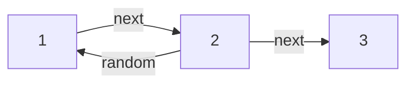
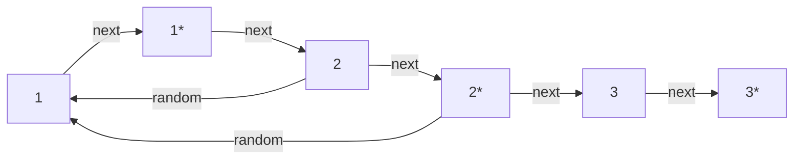
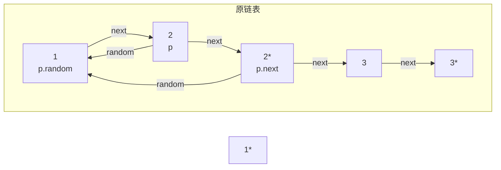
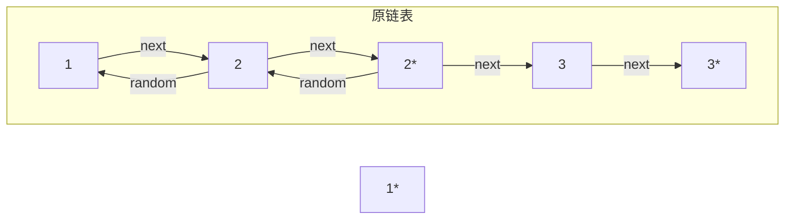
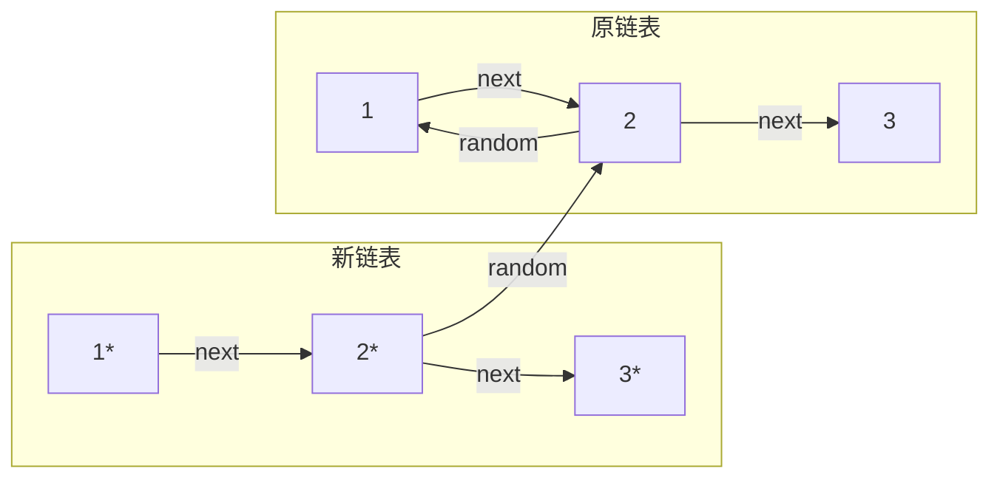

# LeetCode 138（随机链表的复制）解答以及官方题解中的一个问题

> https://leetcode.cn/problems/copy-list-with-random-pointer
>
> 给你一个长度为 `n` 的链表，每个节点包含一个额外增加的随机指针 `random` ，该指针可以指向链表中的任何节点或空节点。
>
> 构造这个链表的 **[深拷贝](https://baike.baidu.com/item/深拷贝/22785317?fr=aladdin)**。 深拷贝应该正好由 `n` 个 **全新** 节点组成，其中每个新节点的值都设为其对应的原节点的值。新节点的 `next` 指针和 `random` 指针也都应指向复制链表中的新节点，并使原链表和复制链表中的这些指针能够表示相同的链表状态。**复制链表中的指针都不应指向原链表中的节点** 。
>
> ```csharp
> // Definition for a Node.
> public class Node {
>  public int val;
>  public Node next;
>  public Node random;
> 
>  public Node(int _val) {
>      val = _val;
>      next = null;
>      random = null;
>  }
> }
> ```
>


## 迭代+哈希表

这是我最早想到的办法，只需要建立原节点和新节点的映射即可。

虽然我的方法只需要一轮遍历，但代码有些冗长（这里的一堆`if else`应该可以拆成一个方法...），别的题解里应该有更好的。

```csharp

public class Solution
{
    public Node? CopyRandomList(Node? head)
    {
        if (head is null) return head;
        var dic = new Dictionary<Node, Node>();
        var p = head;
        var pNew = new Node(head.val);
        dic[p] = pNew;
        // 先处理第一个节点 
        if (p.random is not null)
        {
            if (dic.TryGetValue(p.random, out var rValue))
            {
                pNew.random = rValue;
            }
            else
            {
                var newNode = new Node(p.random.val);
                pNew.random = newNode;
                dic[p.random] = newNode;
            }
        }
        var hNew = pNew;
        p = p.next;
        while (p is not null)
        {
            // 尝试从哈希表中获取当前节点(p)对应的新节点，若没有则创建并加入
            if (dic.TryGetValue(p, out var value))
            {
                pNew.next = value;
            }
            else
            {
                var newNode = new Node(p.val);
                dic[p] = newNode;
                pNew.next = newNode;
            }
            // 对p.random做相同操作
            if (p.random is not null)
            {
                if (dic.TryGetValue(p.random, out var rValue))
                {
                    pNew.next.random = rValue;
                }
                else
                {
                    var newNode = new Node(p.random.val);
                    pNew.next.random = newNode;
                    dic[p.random] = newNode;
                }
            }
            p = p.next;
            pNew = pNew.next;
        }
        return hNew;
    }
}
```


## 递归+哈希表

使用递归之后代码简洁了许多，因为本质上我们对`p`节点本身和`p.random`做的操作是相同的（尝试从哈希表中获取，若没有则创建）

```csharp
public class Solution
{
    private Dictionary<Node, Node> _nodes = new Dictionary<Node, Node>();
    public Node? CopyRandomList(Node? head)
    {
        if (head is null) return null;
        if (_nodes.TryGetValue(head, out var cached))
        {
            return cached;
        }
        var newNode = new Node(head.val);
        _nodes[head] = newNode;
        newNode.next = CopyRandomList(head.next);
        newNode.random = CopyRandomList(head.random);
        return newNode;
    }
}
```


## 复制节点

这个方法第一次做的时候不一定想得出来，但理解起来应该不难

将节点复制一遍后，`p`作为旧节点，`p.next`就一定是新创建的节点，同理，`p.random.next`指向的也是新的节点。

我们只需要将新节点的`random`都调整为它的下个节点，最后将原链表与新链表拆分即可。

由于无需哈希表，空间复杂度就从*O*(*N*)降到了*O*(1)，但需要进行三次遍历。

```csharp
public class Solution
{
    public Node? CopyRandomList(Node? head)
    {
        if (head is null) return head;
        var p = head;
        // 1.复制全部节点
        while (p is not null)
        {
            var newNode = new Node(p.val, p.next);
            p.next = newNode;
            p = newNode.next;
        }

        // 2.将新节点的random节点指向对应的节点
        p = head;
        while (p is not null)
        {
            if (p.random is not null)
            {
                p.next.random = p.random.next;
            }
            p = p.next.next;
        }

        // 3.将新链表从原链表中拆分出来
        p = head;
        var result = p.next;
        while (p?.next is not null)
        {
            var tmp = p.next;
            p.next = p.next.next;
            tmp.next = tmp.next?.next;
            p = p.next;
        }
        return result;
    }
}
```

然而，官方在解答后面还加了一句话

>读者们也可以自行尝试在计算拷贝节点的随机指针的同时计算其后继指针，这样只需要遍历两次。

看似很合理对吧？计算随机指针的同时完成链表拆分的操作，代码如下

```csharp
public class Solution
{
    public Node? CopyRandomList(Node? head)
    {
        if (head is null) return head;
        var p = head;
        // 1.复制全部节点
        while (p is not null)
        {
            var newNode = new Node(p.val, p.next);
            p.next = newNode;
            p = newNode.next;
        }


        p = head;
        var result = head.next;
        while (p is not null)
        {
            // 计算随机指针
            if (p.random is not null)
            {
                p.next.random = p.random.next;
            }
            // 拆分链表
            var tmp = p.next;
            p.next = tmp?.next;
            p = p.next;
            tmp.next = p?.next;
        }
        return result;
    }
}
```

然而这段代码是无法通过的：

```
测试用例：[[7,null],[13,0],[11,4],[10,2],[1,0]]
结果：Random pointer of node with label 13 points to a node from the original list.
```

新链表中的`random`被指向了原链表中的节点。这是为什么呢？

假设有链表如下：



复制完毕节点后，应该是这样的



我们现在对2节点进行操作：



由于1节点已经被拆分，1节点的`next`不再指向新创建的1\*节点而是2节点。这时若调用`p.next.random = p.random.next`就会导致2\*的`random`被错误的指向了原链表中的2节点



最终拆分结果就会变成这样




> 当某个节点的`random`指向**前面已被拆分**的原节点时，那个原节点的`next`不再指向其克隆节点，导致使用`p.random.next`得到的是**原链表中的下一个原节点**，而不是克隆节点。

因此，我个人认为空间复杂度为*O*(1)且只用两遍循环完成的方法是无法实现的。

~~当然，如果有人做出来了可以来踢我一脚x~~