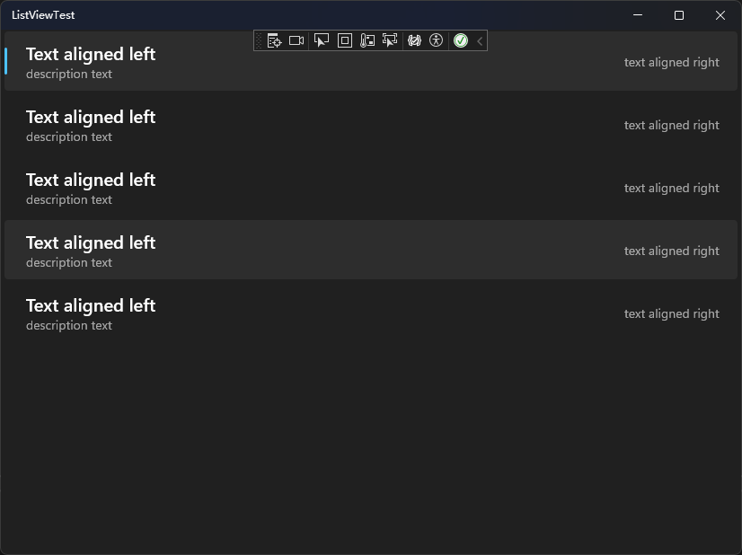
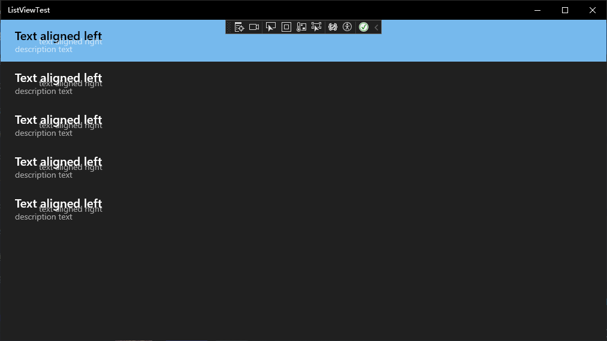
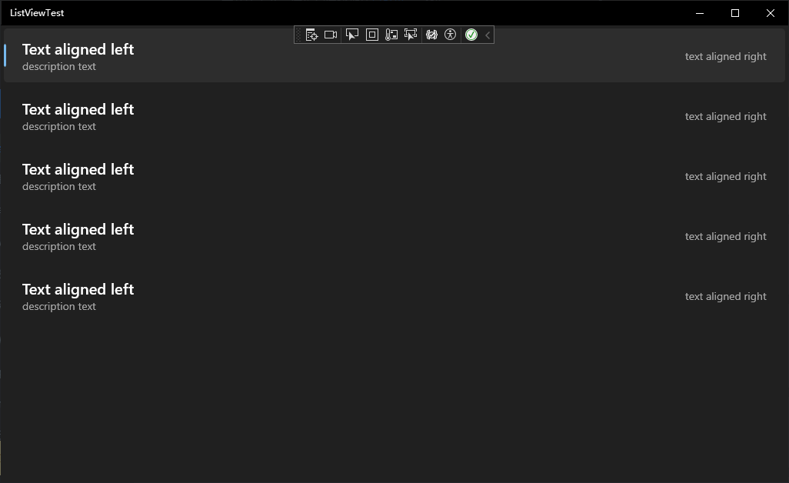

# UWP开发:修复Win10上ListView样式不正确的问题

在Windows 11下，使用WinUI2.6以上版本的`ListView`长这样：

然而到了Win10上，尽管其他控件的样式没有改变，但`ListViewItem`变成了默认样式（初代Fluent）
最重大的问题是，Win10上的`HorizontalAlignment`未被设置成`Stretch`，可能造成严重的UI错位（隔壁livelyweather也有[这个问题](https://github.com/rocksdanister/weather/issues/54)）。


这疑似是Win10上未使用正确的资源造成的。

***

为了解决此问题，我们可以在`App.xaml`中的`App.Resources`中添加以下样式（从VS Blender复制），并将其作为`ListViewItem`的默认样式即可
注：此处使用了条件XAML语句，这样在Win11上就可以使用自带的样式（似乎多一点动画），将`contract13NotPresent`删去问题也不大

```xml
xmlns:contract13NotPresent="http://schemas.microsoft.com/winfx/2006/xaml/presentation?IsApiContractNotPresent(Windows.Foundation.UniversalApiContract,13)"
```

```XML
    <contract13NotPresent:Style BasedOn="{StaticResource Win11ListViewItemStyle}" TargetType="ListViewItem" />
    <Thickness x:Key="ListItemMargin">4</Thickness>
    <Style x:Key="Win11ListViewItemStyle"  TargetType="ListViewItem">
        <Setter Property="FontFamily" Value="{ThemeResource ContentControlThemeFontFamily}"/>
        <Setter Property="FontSize" Value="{ThemeResource ControlContentThemeFontSize}"/>
        <Setter Property="BorderBrush" Value="{x:Null}"/>
        <Setter Property="BorderThickness" Value="0"/>
        <Setter Property="Background" Value="Transparent"/>
        <Setter Property="Foreground" Value="{ThemeResource SystemControlForegroundBaseHighBrush}"/>
        <Setter Property="TabNavigation" Value="Local"/>
        <Setter Property="IsHoldingEnabled" Value="True"/>
        <Setter Property="Padding" Value="12,0,12,0"/>
        <Setter Property="HorizontalContentAlignment" Value="Stretch"/>
        <Setter Property="VerticalContentAlignment" Value="Center"/>
        <Setter Property="MinWidth" Value="{ThemeResource ListViewItemMinWidth}"/>
        <Setter Property="MinHeight" Value="{ThemeResource ListViewItemMinHeight}"/>
        <Setter Property="MaxWidth" Value="1224"/>
        <Setter Property="AllowDrop" Value="False"/>
        <Setter Property="UseSystemFocusVisuals" Value="{StaticResource UseSystemFocusVisuals}"/>
        <Setter Property="FocusVisualMargin" Value="0"/>
        <Setter Property="CornerRadius" Value="{StaticResource ControlCornerRadius}"/>
        <Setter Property="Template">
            <Setter.Value>
                <ControlTemplate TargetType="ListViewItem">
                    <Grid x:Name="ContentBorder" Background="{TemplateBinding Background}" BorderBrush="{TemplateBinding BorderBrush}" BorderThickness="{TemplateBinding BorderThickness}" CornerRadius="{TemplateBinding CornerRadius}" FocusVisualMargin="{TemplateBinding FocusVisualMargin}" Control.IsTemplateFocusTarget="True" Margin="{StaticResource ListItemMargin}" RenderTransformOrigin="0.5,0.5">
                        <Grid.RenderTransform>
                            <ScaleTransform x:Name="ContentBorderScale"/>
                        </Grid.RenderTransform>
                        <VisualStateManager.VisualStateGroups>
                            <VisualStateGroup x:Name="CommonStates">
                                <VisualState x:Name="Normal">
                                    <Storyboard>
                                        <PointerUpThemeAnimation Storyboard.TargetName="ContentPresenter"/>
                                    </Storyboard>
                                </VisualState>
                                <VisualState x:Name="PointerOver">
                                    <Storyboard>
                                        <DoubleAnimation Duration="0" Storyboard.TargetName="BorderBackground" To="0.6" Storyboard.TargetProperty="Opacity"/>
                                        <ObjectAnimationUsingKeyFrames Storyboard.TargetName="BorderBackground" Storyboard.TargetProperty="Background">
                                            <DiscreteObjectKeyFrame KeyTime="0" Value="{ThemeResource SystemControlHighlightListLowBrush}"/>
                                        </ObjectAnimationUsingKeyFrames>
                                        <ObjectAnimationUsingKeyFrames Storyboard.TargetName="ContentPresenter" Storyboard.TargetProperty="Foreground">
                                            <DiscreteObjectKeyFrame KeyTime="0" Value="{ThemeResource SystemControlHighlightAltBaseHighBrush}"/>
                                        </ObjectAnimationUsingKeyFrames>
                                        <ObjectAnimationUsingKeyFrames Storyboard.TargetName="MultiSelectSquare" Storyboard.TargetProperty="BorderBrush">
                                            <DiscreteObjectKeyFrame KeyTime="0" Value="{ThemeResource SystemControlHighlightAltBaseHighBrush}"/>
                                        </ObjectAnimationUsingKeyFrames>
                                        <ObjectAnimationUsingKeyFrames Storyboard.TargetName="MultiSelectCheck" Storyboard.TargetProperty="Foreground">
                                            <DiscreteObjectKeyFrame KeyTime="0" Value="{ThemeResource SystemControlHighlightAltBaseHighBrush}"/>
                                        </ObjectAnimationUsingKeyFrames>
                                        <PointerUpThemeAnimation Storyboard.TargetName="ContentPresenter"/>
                                    </Storyboard>
                                </VisualState>
                                <VisualState x:Name="Pressed">
                                    <Storyboard>
                                        <DoubleAnimation Duration="0" Storyboard.TargetName="BorderBackground" To="0.6" Storyboard.TargetProperty="Opacity"/>
                                        <ObjectAnimationUsingKeyFrames Storyboard.TargetName="BorderBackground" Storyboard.TargetProperty="Background">
                                            <DiscreteObjectKeyFrame KeyTime="0" Value="{ThemeResource SystemControlHighlightListLowBrush}"/>
                                        </ObjectAnimationUsingKeyFrames>
                                        <ObjectAnimationUsingKeyFrames Storyboard.TargetName="ContentPresenter" Storyboard.TargetProperty="Foreground">
                                            <DiscreteObjectKeyFrame KeyTime="0" Value="{ThemeResource SystemControlHighlightAltBaseHighBrush}"/>
                                        </ObjectAnimationUsingKeyFrames>
                                        <ObjectAnimationUsingKeyFrames Storyboard.TargetName="MultiSelectSquare" Storyboard.TargetProperty="BorderBrush">
                                            <DiscreteObjectKeyFrame KeyTime="0" Value="{ThemeResource SystemControlHighlightAltBaseHighBrush}"/>
                                        </ObjectAnimationUsingKeyFrames>
                                        <ObjectAnimationUsingKeyFrames Storyboard.TargetName="MultiSelectCheck" Storyboard.TargetProperty="Foreground">
                                            <DiscreteObjectKeyFrame KeyTime="0" Value="{ThemeResource SystemControlHighlightAltBaseHighBrush}"/>
                                        </ObjectAnimationUsingKeyFrames>
                                        <PointerDownThemeAnimation TargetName="ContentPresenter"/>
                                    </Storyboard>
                                </VisualState>
                                <VisualState x:Name="Selected">
                                    <Storyboard>
                                        <DoubleAnimation Duration="0:0:0" Storyboard.TargetName="MultiSelectCheck" To="1" Storyboard.TargetProperty="Opacity"/>
                                        <DoubleAnimation Duration="0" Storyboard.TargetName="BorderBackground" To="0.6" Storyboard.TargetProperty="Opacity"/>
                                        <ObjectAnimationUsingKeyFrames Storyboard.TargetName="BorderBackground" Storyboard.TargetProperty="Background">
                                            <DiscreteObjectKeyFrame KeyTime="0" Value="{ThemeResource SystemControlHighlightListLowBrush}"/>
                                        </ObjectAnimationUsingKeyFrames>
                                        <ObjectAnimationUsingKeyFrames Storyboard.TargetName="BorderSelected" Storyboard.TargetProperty="Background">
                                            <DiscreteObjectKeyFrame KeyTime="0" Value="{ThemeResource SystemAccentColorLight2}"/>
                                        </ObjectAnimationUsingKeyFrames>
                                        <ObjectAnimationUsingKeyFrames Storyboard.TargetName="ContentPresenter" Storyboard.TargetProperty="Foreground">
                                            <DiscreteObjectKeyFrame KeyTime="0" Value="{ThemeResource SystemControlHighlightAltBaseHighBrush}"/>
                                        </ObjectAnimationUsingKeyFrames>
                                        <ObjectAnimationUsingKeyFrames Storyboard.TargetName="MultiSelectSquare" Storyboard.TargetProperty="BorderBrush">
                                            <DiscreteObjectKeyFrame KeyTime="0" Value="{ThemeResource SystemControlHighlightAltBaseHighBrush}"/>
                                        </ObjectAnimationUsingKeyFrames>
                                        <ObjectAnimationUsingKeyFrames Storyboard.TargetName="MultiSelectCheck" Storyboard.TargetProperty="Foreground">
                                            <DiscreteObjectKeyFrame KeyTime="0" Value="{ThemeResource SystemControlHighlightAltBaseHighBrush}"/>
                                        </ObjectAnimationUsingKeyFrames>
                                        <PointerUpThemeAnimation Storyboard.TargetName="ContentPresenter"/>
                                    </Storyboard>
                                </VisualState>
                                <VisualState x:Name="PointerOverSelected">
                                    <Storyboard>
                                        <DoubleAnimation Duration="0:0:0" Storyboard.TargetName="MultiSelectCheck" To="1" Storyboard.TargetProperty="Opacity"/>
                                        <DoubleAnimation Duration="0" Storyboard.TargetName="BorderBackground" To="0.5" Storyboard.TargetProperty="Opacity"/>
                                        <ObjectAnimationUsingKeyFrames Storyboard.TargetName="BorderBackground" Storyboard.TargetProperty="Background">
                                            <DiscreteObjectKeyFrame KeyTime="0" Value="{ThemeResource SystemControlHighlightListMediumBrush}"/>
                                        </ObjectAnimationUsingKeyFrames>
                                        <ObjectAnimationUsingKeyFrames Storyboard.TargetName="BorderSelected" Storyboard.TargetProperty="Background">
                                            <DiscreteObjectKeyFrame KeyTime="0" Value="{ThemeResource SystemAccentColorLight2}"/>
                                        </ObjectAnimationUsingKeyFrames>
                                        <ObjectAnimationUsingKeyFrames Storyboard.TargetName="ContentPresenter" Storyboard.TargetProperty="Foreground">
                                            <DiscreteObjectKeyFrame KeyTime="0" Value="{ThemeResource SystemControlHighlightAltBaseHighBrush}"/>
                                        </ObjectAnimationUsingKeyFrames>
                                        <ObjectAnimationUsingKeyFrames Storyboard.TargetName="MultiSelectSquare" Storyboard.TargetProperty="BorderBrush">
                                            <DiscreteObjectKeyFrame KeyTime="0" Value="{ThemeResource SystemControlHighlightAltBaseHighBrush}"/>
                                        </ObjectAnimationUsingKeyFrames>
                                        <ObjectAnimationUsingKeyFrames Storyboard.TargetName="MultiSelectCheck" Storyboard.TargetProperty="Foreground">
                                            <DiscreteObjectKeyFrame KeyTime="0" Value="{ThemeResource SystemControlHighlightAltBaseHighBrush}"/>
                                        </ObjectAnimationUsingKeyFrames>
                                        <PointerUpThemeAnimation Storyboard.TargetName="ContentPresenter"/>
                                    </Storyboard>
                                </VisualState>
                                <VisualState x:Name="PressedSelected">
                                    <Storyboard>
                                        <DoubleAnimation Duration="0:0:0" Storyboard.TargetName="MultiSelectCheck" To="1" Storyboard.TargetProperty="Opacity"/>
                                        <DoubleAnimation Duration="0" Storyboard.TargetName="BorderBackground" To="0.6" Storyboard.TargetProperty="Opacity"/>
                                        <ObjectAnimationUsingKeyFrames Storyboard.TargetName="BorderBackground" Storyboard.TargetProperty="Background">
                                            <DiscreteObjectKeyFrame KeyTime="0" Value="{ThemeResource SystemControlHighlightListMediumBrush}"/>
                                        </ObjectAnimationUsingKeyFrames>
                                        <ObjectAnimationUsingKeyFrames Storyboard.TargetName="BorderSelected" Storyboard.TargetProperty="Background">
                                            <DiscreteObjectKeyFrame KeyTime="0" Value="{ThemeResource SystemAccentColorLight2}"/>
                                        </ObjectAnimationUsingKeyFrames>
                                        <ObjectAnimationUsingKeyFrames Storyboard.TargetName="ContentPresenter" Storyboard.TargetProperty="Foreground">
                                            <DiscreteObjectKeyFrame KeyTime="0" Value="{ThemeResource SystemControlHighlightAltBaseHighBrush}"/>
                                        </ObjectAnimationUsingKeyFrames>
                                        <ObjectAnimationUsingKeyFrames Storyboard.TargetName="MultiSelectSquare" Storyboard.TargetProperty="BorderBrush">
                                            <DiscreteObjectKeyFrame KeyTime="0" Value="{ThemeResource SystemControlHighlightAltBaseHighBrush}"/>
                                        </ObjectAnimationUsingKeyFrames>
                                        <ObjectAnimationUsingKeyFrames Storyboard.TargetName="MultiSelectCheck" Storyboard.TargetProperty="Foreground">
                                            <DiscreteObjectKeyFrame KeyTime="0" Value="{ThemeResource SystemControlHighlightAltBaseHighBrush}"/>
                                        </ObjectAnimationUsingKeyFrames>
                                        <PointerDownThemeAnimation TargetName="ContentPresenter"/>
                                    </Storyboard>
                                </VisualState>
                            </VisualStateGroup>
                            <VisualStateGroup x:Name="DisabledStates">
                                <VisualState x:Name="Enabled"/>
                                <VisualState x:Name="Disabled">
                                    <Storyboard>
                                        <DoubleAnimation Duration="0" Storyboard.TargetName="ContentBorder" To="{ThemeResource ListViewItemDisabledThemeOpacity}" Storyboard.TargetProperty="Opacity"/>
                                    </Storyboard>
                                </VisualState>
                            </VisualStateGroup>
                            <VisualStateGroup x:Name="MultiSelectStates">
                                <VisualState x:Name="MultiSelectDisabled">
                                    <Storyboard>
                                        <DoubleAnimationUsingKeyFrames Storyboard.TargetName="MultiSelectCheckBoxTransform" Storyboard.TargetProperty="X">
                                            <EasingDoubleKeyFrame KeyTime="0:0:0" Value="0"/>
                                            <SplineDoubleKeyFrame KeyTime="0:0:0.333" KeySpline="0.1,0.9,0.2,1" Value="-32"/>
                                        </DoubleAnimationUsingKeyFrames>
                                        <DoubleAnimationUsingKeyFrames Storyboard.TargetName="MultiSelectClipTransform" Storyboard.TargetProperty="X">
                                            <EasingDoubleKeyFrame KeyTime="0:0:0" Value="0"/>
                                            <SplineDoubleKeyFrame KeyTime="0:0:0.333" KeySpline="0.1,0.9,0.2,1" Value="32"/>
                                        </DoubleAnimationUsingKeyFrames>
                                        <DoubleAnimationUsingKeyFrames Storyboard.TargetName="ContentPresenterTranslateTransform" Storyboard.TargetProperty="X">
                                            <EasingDoubleKeyFrame KeyTime="0:0:0" Value="32"/>
                                            <SplineDoubleKeyFrame KeyTime="0:0:0.333" KeySpline="0.1,0.9,0.2,1" Value="0"/>
                                        </DoubleAnimationUsingKeyFrames>
                                        <ObjectAnimationUsingKeyFrames Storyboard.TargetName="MultiSelectSquare" Storyboard.TargetProperty="Visibility">
                                            <DiscreteObjectKeyFrame KeyTime="0" Value="Visible"/>
                                            <DiscreteObjectKeyFrame KeyTime="0:0:0.333" Value="Collapsed"/>
                                        </ObjectAnimationUsingKeyFrames>
                                    </Storyboard>
                                </VisualState>
                                <VisualState x:Name="MultiSelectEnabled">
                                    <Storyboard>
                                        <DoubleAnimationUsingKeyFrames Storyboard.TargetName="MultiSelectCheckBoxTransform" Storyboard.TargetProperty="X">
                                            <EasingDoubleKeyFrame KeyTime="0:0:0" Value="-32"/>
                                            <SplineDoubleKeyFrame KeyTime="0:0:0.333" KeySpline="0.1,0.9,0.2,1" Value="0"/>
                                        </DoubleAnimationUsingKeyFrames>
                                        <DoubleAnimationUsingKeyFrames Storyboard.TargetName="MultiSelectClipTransform" Storyboard.TargetProperty="X">
                                            <EasingDoubleKeyFrame KeyTime="0:0:0" Value="32"/>
                                            <SplineDoubleKeyFrame KeyTime="0:0:0.333" KeySpline="0.1,0.9,0.2,1" Value="0"/>
                                        </DoubleAnimationUsingKeyFrames>
                                        <DoubleAnimationUsingKeyFrames Storyboard.TargetName="ContentPresenterTranslateTransform" Storyboard.TargetProperty="X">
                                            <EasingDoubleKeyFrame KeyTime="0:0:0" Value="-32"/>
                                            <SplineDoubleKeyFrame KeyTime="0:0:0.333" KeySpline="0.1,0.9,0.2,1" Value="0"/>
                                        </DoubleAnimationUsingKeyFrames>
                                        <ObjectAnimationUsingKeyFrames Storyboard.TargetName="MultiSelectSquare" Storyboard.TargetProperty="Visibility">
                                            <DiscreteObjectKeyFrame KeyTime="0" Value="Visible"/>
                                        </ObjectAnimationUsingKeyFrames>
                                        <ObjectAnimationUsingKeyFrames Storyboard.TargetName="MultiSelectCheck" Storyboard.TargetProperty="Visibility">
                                            <DiscreteObjectKeyFrame KeyTime="0" Value="Visible"/>
                                        </ObjectAnimationUsingKeyFrames>
                                        <ObjectAnimationUsingKeyFrames Storyboard.TargetName="ContentPresenterGrid" Storyboard.TargetProperty="Margin">
                                            <DiscreteObjectKeyFrame KeyTime="0" Value="32,0,0,0"/>
                                        </ObjectAnimationUsingKeyFrames>
                                    </Storyboard>
                                </VisualState>
                            </VisualStateGroup>
                            <VisualStateGroup x:Name="DataVirtualizationStates">
                                <VisualState x:Name="DataAvailable"/>
                                <VisualState x:Name="DataPlaceholder">
                                    <Storyboard>
                                        <ObjectAnimationUsingKeyFrames Storyboard.TargetName="PlaceholderTextBlock" Storyboard.TargetProperty="Visibility">
                                            <DiscreteObjectKeyFrame KeyTime="0" Value="Visible"/>
                                        </ObjectAnimationUsingKeyFrames>
                                        <ObjectAnimationUsingKeyFrames Storyboard.TargetName="PlaceholderRect" Storyboard.TargetProperty="Visibility">
                                            <DiscreteObjectKeyFrame KeyTime="0" Value="Visible"/>
                                        </ObjectAnimationUsingKeyFrames>
                                    </Storyboard>
                                </VisualState>
                            </VisualStateGroup>
                            <VisualStateGroup x:Name="ReorderHintStates">
                                <VisualStateGroup.Transitions>
                                    <VisualTransition GeneratedDuration="0:0:0.2" To="NoReorderHint"/>
                                </VisualStateGroup.Transitions>
                                <VisualState x:Name="NoReorderHint"/>
                                <VisualState x:Name="BottomReorderHint">
                                    <Storyboard>
                                        <DragOverThemeAnimation Direction="Bottom" ToOffset="{ThemeResource ListViewItemReorderHintThemeOffset}" TargetName="ContentBorder"/>
                                    </Storyboard>
                                </VisualState>
                                <VisualState x:Name="TopReorderHint">
                                    <Storyboard>
                                        <DragOverThemeAnimation Direction="Top" ToOffset="{ThemeResource ListViewItemReorderHintThemeOffset}" TargetName="ContentBorder"/>
                                    </Storyboard>
                                </VisualState>
                                <VisualState x:Name="RightReorderHint">
                                    <Storyboard>
                                        <DragOverThemeAnimation Direction="Right" ToOffset="{ThemeResource ListViewItemReorderHintThemeOffset}" TargetName="ContentBorder"/>
                                    </Storyboard>
                                </VisualState>
                                <VisualState x:Name="LeftReorderHint">
                                    <Storyboard>
                                        <DragOverThemeAnimation Direction="Left" ToOffset="{ThemeResource ListViewItemReorderHintThemeOffset}" TargetName="ContentBorder"/>
                                    </Storyboard>
                                </VisualState>
                            </VisualStateGroup>
                            <VisualStateGroup x:Name="DragStates">
                                <VisualStateGroup.Transitions>
                                    <VisualTransition GeneratedDuration="0:0:0.2" To="NotDragging"/>
                                </VisualStateGroup.Transitions>
                                <VisualState x:Name="NotDragging"/>
                                <VisualState x:Name="Dragging">
                                    <Storyboard>
                                        <DoubleAnimation Duration="0" Storyboard.TargetName="ContentBorder" To="{ThemeResource ListViewItemDragThemeOpacity}" Storyboard.TargetProperty="Opacity"/>
                                        <DragItemThemeAnimation TargetName="ContentBorder"/>
                                    </Storyboard>
                                </VisualState>
                                <VisualState x:Name="DraggingTarget"/>
                                <VisualState x:Name="MultipleDraggingPrimary">
                                    <Storyboard>
                                        <DoubleAnimation Duration="0" Storyboard.TargetName="MultiArrangeOverlayText" To="1" Storyboard.TargetProperty="Opacity"/>
                                        <DoubleAnimation Duration="0" Storyboard.TargetName="MultiArrangeOverlayTextBorder" To="1" Storyboard.TargetProperty="Opacity"/>
                                        <DoubleAnimation Duration="0" Storyboard.TargetName="MultiSelectSquare" To="0" Storyboard.TargetProperty="Opacity"/>
                                        <DoubleAnimation Duration="0" Storyboard.TargetName="MultiSelectCheck" To="0" Storyboard.TargetProperty="Opacity"/>
                                        <DoubleAnimation Duration="0" Storyboard.TargetName="ContentBorder" To="{ThemeResource ListViewItemDragThemeOpacity}" Storyboard.TargetProperty="Opacity"/>
                                        <FadeInThemeAnimation TargetName="MultiArrangeOverlayText"/>
                                        <FadeInThemeAnimation TargetName="MultiArrangeOverlayTextBorder"/>
                                        <DragItemThemeAnimation TargetName="ContentBorder"/>
                                    </Storyboard>
                                </VisualState>
                                <VisualState x:Name="MultipleDraggingSecondary"/>
                                <VisualState x:Name="DraggedPlaceholder"/>
                                <VisualState x:Name="Reordering">
                                    <Storyboard>
                                        <DoubleAnimation Duration="0:0:0.240" Storyboard.TargetName="ContentBorder" To="{ThemeResource ListViewItemReorderThemeOpacity}" Storyboard.TargetProperty="Opacity"/>
                                    </Storyboard>
                                </VisualState>
                                <VisualState x:Name="ReorderingTarget">
                                    <Storyboard>
                                        <DoubleAnimation Duration="0:0:0.240" Storyboard.TargetName="ContentBorder" To="{ThemeResource ListViewItemReorderTargetThemeOpacity}" Storyboard.TargetProperty="Opacity"/>
                                        <DoubleAnimation Duration="0:0:0.240" Storyboard.TargetName="ContentBorderScale" To="{ThemeResource ListViewItemReorderTargetThemeScale}" Storyboard.TargetProperty="ScaleX"/>
                                        <DoubleAnimation Duration="0:0:0.240" Storyboard.TargetName="ContentBorderScale" To="{ThemeResource ListViewItemReorderTargetThemeScale}" Storyboard.TargetProperty="ScaleY"/>
                                    </Storyboard>
                                </VisualState>
                                <VisualState x:Name="MultipleReorderingPrimary">
                                    <Storyboard>
                                        <DoubleAnimation Duration="0" Storyboard.TargetName="MultiArrangeOverlayText" To="1" Storyboard.TargetProperty="Opacity"/>
                                        <DoubleAnimation Duration="0" Storyboard.TargetName="MultiArrangeOverlayTextBorder" To="1" Storyboard.TargetProperty="Opacity"/>
                                        <DoubleAnimation Duration="0" Storyboard.TargetName="MultiSelectSquare" To="0" Storyboard.TargetProperty="Opacity"/>
                                        <DoubleAnimation Duration="0" Storyboard.TargetName="MultiSelectCheck" To="0" Storyboard.TargetProperty="Opacity"/>
                                        <DoubleAnimation Duration="0:0:0.240" Storyboard.TargetName="ContentBorder" To="{ThemeResource ListViewItemDragThemeOpacity}" Storyboard.TargetProperty="Opacity"/>
                                        <FadeInThemeAnimation TargetName="MultiArrangeOverlayText"/>
                                        <FadeInThemeAnimation TargetName="MultiArrangeOverlayTextBorder"/>
                                    </Storyboard>
                                </VisualState>
                                <VisualState x:Name="ReorderedPlaceholder">
                                    <Storyboard>
                                        <FadeOutThemeAnimation TargetName="ContentBorder"/>
                                    </Storyboard>
                                </VisualState>
                                <VisualState x:Name="DragOver">
                                    <Storyboard>
                                        <DropTargetItemThemeAnimation TargetName="ContentBorder"/>
                                    </Storyboard>
                                </VisualState>
                            </VisualStateGroup>
                        </VisualStateManager.VisualStateGroups>
                        <Border x:Name="BorderBackground" Background="{ThemeResource SystemAccentColorDark1}" CornerRadius="{TemplateBinding CornerRadius}" IsHitTestVisible="False" Control.IsTemplateFocusTarget="True" Opacity="0"/>
                        <Border x:Name="BorderSelected" Background="Transparent" CornerRadius="2" HorizontalAlignment="Left" IsHitTestVisible="False" Control.IsTemplateFocusTarget="True" Margin="0,20" Width="3"/>
                        <Grid x:Name="ContentPresenterGrid" Background="Transparent" Margin="0,0,0,0">
                            <Grid.RenderTransform>
                                <TranslateTransform x:Name="ContentPresenterTranslateTransform"/>
                            </Grid.RenderTransform>
                            <ContentPresenter x:Name="ContentPresenter" ContentTemplate="{TemplateBinding ContentTemplate}" Content="{TemplateBinding Content}" ContentTransitions="{TemplateBinding ContentTransitions}" HorizontalAlignment="{TemplateBinding HorizontalContentAlignment}" Margin="{TemplateBinding Padding}" VerticalAlignment="{TemplateBinding VerticalContentAlignment}"/>
                        </Grid>
                        <TextBlock x:Name="PlaceholderTextBlock" AutomationProperties.AccessibilityView="Raw" Foreground="{x:Null}" IsHitTestVisible="False" Margin="{TemplateBinding Padding}" Opacity="0" Text="Xg"/>
                        <Rectangle x:Name="PlaceholderRect" Fill="{ThemeResource ListViewItemPlaceholderBackground}" Visibility="Collapsed"/>
                        <Border x:Name="MultiSelectSquare" BorderBrush="{ThemeResource SystemControlForegroundBaseMediumHighBrush}" BorderThickness="2" HorizontalAlignment="Left" Height="20" Margin="12,0,0,0" VerticalAlignment="Center" Visibility="Collapsed" Width="20">
                            <Border.Clip>
                                <RectangleGeometry Rect="0,0,20,20">
                                    <RectangleGeometry.Transform>
                                        <TranslateTransform x:Name="MultiSelectClipTransform"/>
                                    </RectangleGeometry.Transform>
                                </RectangleGeometry>
                            </Border.Clip>
                            <Border.RenderTransform>
                                <TranslateTransform x:Name="MultiSelectCheckBoxTransform"/>
                            </Border.RenderTransform>
                            <FontIcon x:Name="MultiSelectCheck" Foreground="{ThemeResource SystemControlForegroundBaseMediumHighBrush}" FontFamily="{ThemeResource SymbolThemeFontFamily}" FontSize="16" Glyph="&#xE73E;" Opacity="0" Visibility="Collapsed"/>
                        </Border>
                        <Border x:Name="MultiArrangeOverlayTextBorder" Background="{ThemeResource SystemControlBackgroundAccentBrush}" BorderBrush="{ThemeResource SystemControlBackgroundChromeWhiteBrush}" BorderThickness="2" HorizontalAlignment="Left" Height="20" IsHitTestVisible="False" Margin="12,0,0,0" MinWidth="20" Opacity="0" VerticalAlignment="Center">
                            <TextBlock x:Name="MultiArrangeOverlayText" AutomationProperties.AccessibilityView="Raw" HorizontalAlignment="Center" IsHitTestVisible="False" Opacity="0" Style="{ThemeResource CaptionTextBlockStyle}" Text="{Binding TemplateSettings.DragItemsCount, RelativeSource={RelativeSource Mode=TemplatedParent}}" VerticalAlignment="Center"/>
                        </Border>
                    </Grid>
                </ControlTemplate>
            </Setter.Value>
        </Setter>
    </Style>
```

***

最终效果（Win10）:


