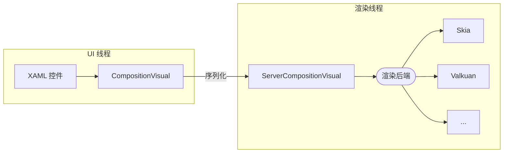

# 在 Avalonia 中编写高性能动画

在 Avalonia 框架中，我们通常使用 XAML 编写动画。然而，实际上 Avalonia 中还存在另一套鲜为人知（？）的动画系统——Composition Animation（合成动画）

本文将介绍如何在 Avalonia 中编写合成动画，以及它相比普通 XAML 动画的优点

## XAML 动画

在介绍合成动画之前，我们先复习一下目前主要使用的 XAML 动画的写法：

```xaml
<Border
    Name="border1"
    Width="200"
    Height="200"
    Background="Red">
    <Border.Styles>
        <Style>
            <Style.Animations>
                <Animation PlaybackDirection="Alternate" IterationCount="10" Duration="0:0:3">
                    <KeyFrame Cue="0%">
                        <Setter Property="TranslateTransform.X" Value="0.0" />
                    </KeyFrame>
                    <KeyFrame Cue="100%">
                        <Setter Property="TranslateTransform.X" Value="1000.0" />
                    </KeyFrame>
                </Animation>
            </Style.Animations>
        </Style>
    </Border.Styles>
</Border>
```

这段代码为 Border 创建了一个动画，让它沿着 X 方向往返移动 10 次

简单易读！然而，这种动画有一个重大的缺陷：它运行在 UI 线程上，因此 UI 线程的高负载操作（如 Measure / Arrange）会严重影响动画的流畅程度。反过来，这些动画也会影响 UI 线程上的输入事件等，给用户体验造成很大影响。如果我们调用 `Thread.Sleep()` 模拟 UI 线程卡顿，动画将会完全停止

<video id="video" controls="" >
      <source id="mp4" src="@source/posts/assets/在 Avalonia 中编写高性能动画
/1.mp4" type="video/mp4">
</video>

而且，Transition 系统也基于相同的原理。因此，在 Avalonia 中你用 XAML 编写的所有动画，理论上都有上面的缺点！

## 合成动画

为了解决这些问题，Avalonia 11 引入了全新的合成（Composition）渲染器，也带来了这篇文章的主角——合成动画（Composition Animation）系统

合成动画不是什么新鲜事物，它最早出现在 UWP / WinUI 中。可惜无论是 WinUI 还是 Avalonia，关于合成动画的资料都少之又少，只能通过硬啃 Avalonia 的源码来略知一二

我们需要知道的是，每个 Avalonia 控件在 UI 线程有一个 CompositionVisual （继承自 CompositionObject），同时在渲染层都有一个对应的 ServerCompositionVisual（继承自 ServerObject）。CompositionObject 上的每个属性在 ServerObject 上都有对应的属性

修改 XAML 控件上的属性时，会先修改 UI 线程的 CompositionVisual 上的相应属性，再序列化到渲染线程的 ServerCompositionVisual。在渲染过程中，合成器会根据 ServerCompositionVisual 上的属性调整渲染指令参数，再将这些指令发送到各个后端进行最终渲染



XAML 动画通过对 XAML 控件上的属性进行插值，而合成动画在渲染层计算并直接修改 ServerObject 上的属性，从而摆脱对 UI 线程的依赖

在 Avalonia 中，我们可以用以下方式定义并使用一个关键帧合成动画：

```csharp
private void AnimateSquare(Compositor compositor, CompositionVisual redVisual)
{
    Vector3KeyFrameAnimation animation = compositor.CreateVector3KeyFrameAnimation();
    animation.InsertKeyFrame(1f, new Vector3(1000f, 0f, 0f));
    animation.Duration = TimeSpan.FromSeconds(2);
    animation.Direction = PlaybackDirection.Alternate;
    animation.IterationCount = 10; // 重复10次
    redVisual.StartAnimation("Translation", animation);
}
```

```csharp
var visual = ElementComposition.GetElementVisual(border1);
AnimateSquare(visual!.Compositor, visual);
```

现在再来调用 `Thread.Sleep()` ，你可以发现合成动画依然能正常运行，完全不受 UI 线程影响！

<video id="video" controls="" >
      <source id="mp4" src="@source/posts/assets/在 Avalonia 中编写高性能动画
/2.mp4" type="video/mp4">
</video>

同样，也可以编写隐式动画，在某个属性变化时自动触发：

```csharp
private ImplicitAnimationCollection? _implicitAnimations;

private void EnsureImplicitAnimations()
{
    var compositor = ElementComposition.GetElementVisual(this)!.Compositor;

    var offsetAnimation = compositor.CreateVector3KeyFrameAnimation();
    offsetAnimation.Target = "Offset";
    offsetAnimation.InsertExpressionKeyFrame(1.0f, "this.FinalValue"); // 将动画最终值设定为更改的目标值
    offsetAnimation.Duration = TimeSpan.FromMilliseconds(400);

    var rotationAnimation = compositor.CreateScalarKeyFrameAnimation();
    rotationAnimation.Target = "RotationAngle";
    rotationAnimation.InsertKeyFrame(.5f, 0.160f);
    rotationAnimation.InsertKeyFrame(1f, 0f);
    rotationAnimation.Duration = TimeSpan.FromMilliseconds(400);

    var animationGroup = compositor.CreateAnimationGroup();
    animationGroup.Add(offsetAnimation);
    animationGroup.Add(rotationAnimation);

    _implicitAnimations = compositor.CreateImplicitAnimationCollection();
    _implicitAnimations["Offset"] = animationGroup; // 在 Offset 变化时自动触发此隐式动画组
}
```

```csharp
// 元素加载完成后调用 
compositionVisual.ImplicitAnimations = _implicitAnimations;
```

<video id="video" controls="" >
      <source id="mp4" src="@source/posts/assets/在 Avalonia 中编写高性能动画
/3.mp4" type="video/mp4">
</video>

然而，合成动画的强大之处远不止于此。

注意到刚刚隐式动画里的 `InsertExpressionKeyFrame` 了吗？这里的字符串不是硬编码的关键字，而是一种用特定语法编写的**表达式**，有一个专门的 [解释器](https://github.com/AvaloniaUI/Avalonia/tree/master/src/Avalonia.Base/Rendering/Composition/Expressions) 负责这些表达式的解析与执行。

在 Avalonia 中，表达式的语法和 WinUI 里的几乎完全相同，可以直接参考 [WinUI 文档](https://learn.microsoft.com/zh-cn/uwp/api/windows.ui.composition.expressionanimation?view=winrt-26100) 。表达式动画非常重要的一个功能就是它可以设置**引用**，即“监听”其他 CompositionObject 上属性的变化并在属性变化时重新对表达式进行计算。

例如，我们就可以基于 ExpressionAnimation 来模拟一堆齿轮（完整代码见 [Avalonia.Labs/samples/Avalonia.Labs.Catalog/Views/Composition/Gears.axaml.cs ](https://github.com/AvaloniaUI/Avalonia.Labs/blob/c451c198cc848335c2affb66793f9ed175a1dfc0/samples/Avalonia.Labs.Catalog/Views/Composition/Gears.axaml.cs)）：

```csharp
private void ConfigureGearAnimation(CompositionVisual currentGear, CompositionVisual previousGear)
{
    var compositor = currentGear.Compositor;
    var rotationExpression = compositor.CreateExpressionAnimation("-prevGear.RotationAngle");
    rotationExpression.SetReferenceParameter("prevGear", previousGear); // "prevGear"相当于 previousGear 在表达式中的"变量名"
    currentGear.StartAnimation("RotationAngle", rotationExpression);
}
```

只需要对第一个齿轮播放动画，后面所有齿轮都会根据前一个齿轮的运动状态旋转。即使有上千个齿轮，动画也能保持较高帧率运行

<video id="video" controls="" >
      <source id="mp4" src="@source/posts/assets/在 Avalonia 中编写高性能动画
/4.mp4" type="video/mp4">
</video>

> 如果觉得字符串表达式写着很恶心，[Avalonia.Labs](https://github.com/AvaloniaUI/Avalonia.Labs) 中的 [ExpressionBuilder](https://github.com/AvaloniaUI/Avalonia.Labs/tree/main/src/Avalonia.Labs.ExpressionBuilder) 能允许你用 C# 代码辅助编写这些表达式
>
> 例如，上面的代码使用 ExpressionBuilder 后就可以变成这样：
>
> ```csharp
> var rotateExpression = - previousGear.GetReference().RotationAngle;
> currentGear.StartAnimation("RotationAngle", rotateExpression);
> ```

当然，合成动画也有一定的局限性。由于在渲染线程运行，我们在 UI 线程无法直接获取到合成动画的进度，UI 线程的 Visual 的属性值和最终渲染所使用的属性值也是不同的

```csharp
var compositionVisual = ElementComposition.GetElementVisual(border1)!;
var animation = compositor.CreateDoubleKeyFrameAnimation();
animation.Duration = TimeSpan.FromSeconds(4);
animation.InsertKeyFrame(0f, 1f);
animation.InsertKeyFrame(1f, 0f);
compositionVisual.StartAnimation("Opacity", animation);
await Task.Delay(2000);
var xamlOpacity = border1.Opacity; // XAML 控件属性 —— 仍为1
var visualOpacity = compositionVisul.Opacity; // UI 线程上的 CompositionVisual —— 仍为1
```

当然，你也可以自己维护一个定时器来大致估算出当前的动画进度和值

## 如何选择？

尽管我个人建议尽可能使用合成动画。然而，合成动画的一个巨大缺陷就是他不适合在 Style 中使用，且编写合成动画所需的代码量远远大于 XAML 动画。因此，目前推荐将合成动画用于以下场景

- 性能敏感
- 动画数量较多
- 需要持续播放
- 多个动画目标互相联动（使用 ExpressionAnimation）

> 目前已经有 [PR](https://github.com/AvaloniaUI/Avalonia/pull/19747) 实现了在 XAML 中编写隐式合成动画，但尚未合并
>
> 官方文档中也记载了一种[方法](https://docs.avaloniaui.net/docs/graphics-animation/composition-animations#integrating-with-xaml-via-attached-properties)（和 PR 中的类似），使用 AttachedProperty 来间接实现在 XAML 中编写合成动画
>
> 一旦有官方 API 能够在 XAML 中编写合成动画，你应该始终选择它而非传统动画