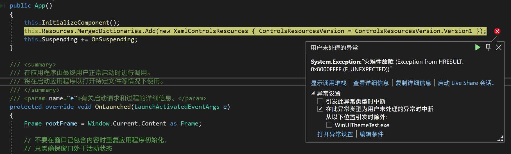
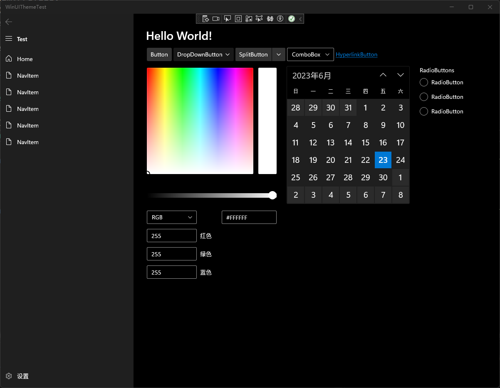
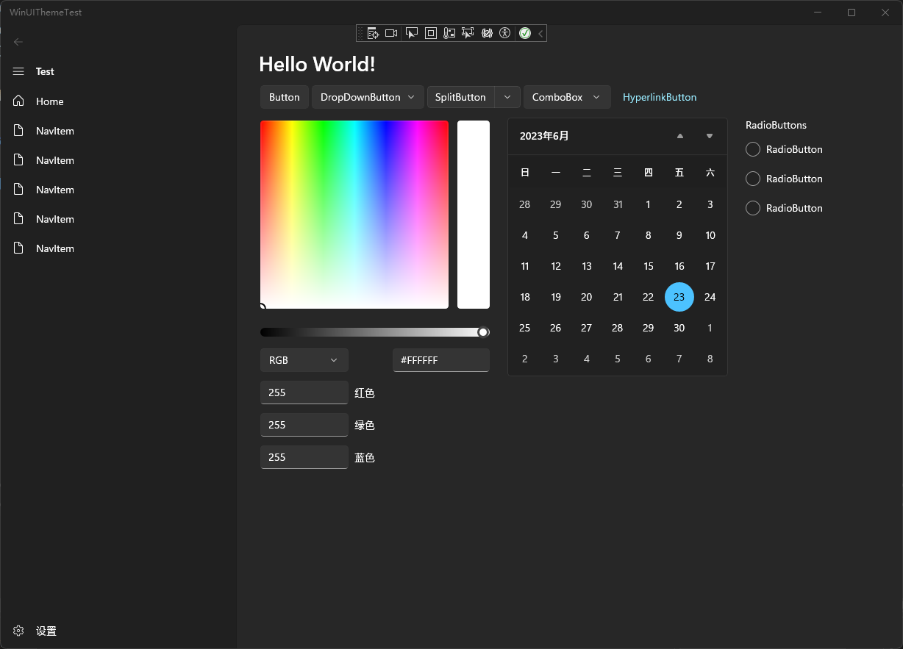

# UWP开发：在一个应用中使用两套WinUI主题

## 在XAML中更改

> 在 https://learn.microsoft.com/zh-cn/windows/apps/design/style/xaml-styles#winui-and-styles 中介绍了在XAML中切换旧版本的方式。

在`App.xaml`中的`XamlControlsResources`内添加一个属性：

`ControlsResourcesVersion="Version1"`

启动应用，就可以看到旧版的控件样式了。

## 在代码中更改

在应用运行的时候，如果我们用XAML热重载强行更改`App.xaml`中的样式版本，应用就会因资源冲突闪退

如果在App.xaml.cs中直接给App.Resources添加`XamlControlsResources`，你会喜提一个报错：


因此，在应用运行或启动时直接更改资源版本是行不通的，我们需要在XAML资源加载之前更改样式的版本

### 1.创建主题文件

创建一个资源字典`Theme.xaml`(也可为其他命名)

同时创建后台代码`Theme.xaml.cs`，此时VS会自动合并两个文件

在Theme.xaml中添加x:Class属性以使用后台代码

```xml
x:Class="WinUIThemeTest.Theme"
```

同时在`Theme.xaml.cs`中作出如下更改

```csharp
namespace WinUIThemeTest
{
    internal partial class Theme:ResourceDictionary
    {
        public Theme()
        {
            this.InitializeComponent();
        }
    }
}
```

### 2.编写后台代码

这时候，我们就可以在Theme的构造函数中对这个资源字典进行合并操作了:

```csharp
public Theme()
{
      this.InitializeComponent();
      this.MergedDictionaries.Add(new XamlControlsResources { ControlsResourcesVersion = ControlsResourcesVersion.Version1 });
}
```


### 3.添加到App.xaml

在App.xaml中添加此资源字典:

```xml
<Application.Resources>
    <ResourceDictionary>
        <ResourceDictionary.MergedDictionaries>
            <local:Theme/>
        </ResourceDictionary.MergedDictionaries>
    </ResourceDictionary>
</Application.Resources>
```

这时，我们启动后同样可以看到旧版控件样式。

### 4.更改逻辑

后台代码控制`XamlControlsResources`版本的好处就是可以根据需求任意更改版本，比如:

(Theme.xaml.cs)

```CSH
public Theme()
{
    this.InitializeComponent();
    if (Environment.OSVersion.Version.Build >= 22000)//判断系统是否为Win11
    {
        this.MergedDictionaries.Add(new XamlControlsResources { ControlsResourcesVersion = ControlsResourcesVersion.Version2 });//添加新版本控件样式
    }
    else
    {
        this.MergedDictionaries.Add(new XamlControlsResources { ControlsResourcesVersion = ControlsResourcesVersion.Version1 });//添加旧版本控件样式
    }
}
```

这样，就可以根据系统版本使用不同控件样式了。
（当然，也可以自己写一些其他的逻辑，如在设置中切换样式等等）

## 最终效果

### 旧版样式



### 新版样式



## 源码

https://github.com/zxbmmmmmmmmm/WinUIThemeSample

## 思路参考

https://github.com/character-map-uwp/Character-Map-UWP
